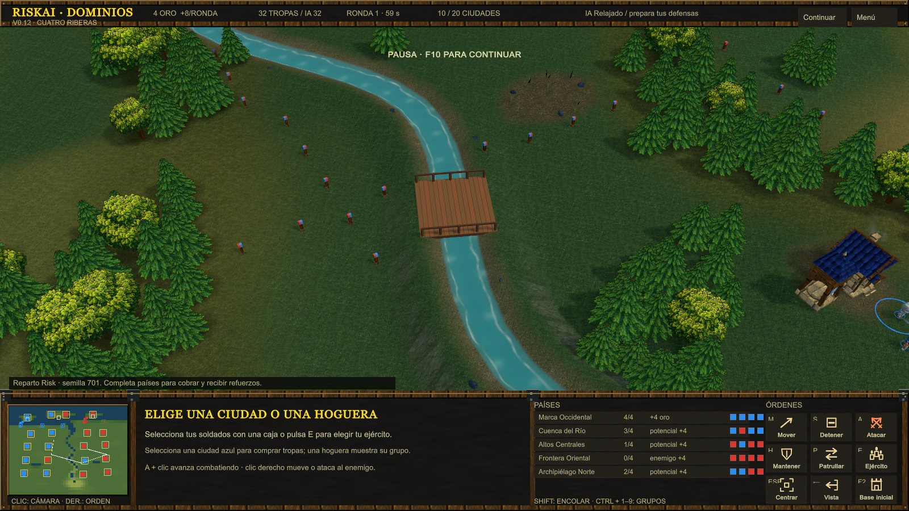

# RiskAI · v0.12

Prototipo RTS de conquista por ciudades, inspirado en los mapas Risk de Warcraft III. Unity 6.3 LTS (6000.3.23f1), URP, partida local contra IA y arte propio/CC0.

Abre **Play-RiskAI.cmd** para jugar la compilación local. El menú permite elegir escenario, reparto, semilla y dificultad antes de empezar. Al clonar el repositorio, genera primero el ejecutable con `scripts/Unity.ps1 -Action Build`. Las compilaciones y las referencias de Warcraft quedan fuera de Git.

Esta versión añade **Cuatro Riberas**, hogueras seleccionables, edificios permanentes, sucesión de guarniciones, defensa reactiva de la IA y economía en la escala de Saran v3. [Cambios y límites](docs/ITERATION-v0.12.md) · [Fuentes de las reglas](docs/RISK-RULES-v0.12.md) · [Validación: 97 pruebas](docs/VALIDATION-v0.12.md) · [Pendientes](TODO.md).



## Escenarios

| Mapa | Ciudades y grupos | Terreno |
| --- | --- | --- |
| Las Marcas | 12 ciudades, 6 grupos de 2 | Dos mesetas con rampas, costas, río de montaña y dos islas con puertos. |
| Cuatro Riberas | 20 ciudades: 4 grupos continentales y un archipiélago; 4 ciudades por grupo | Más espacio, río largo desde la montaña meridional, dos cruces y tres islas. |

Los postes indican fronteras y propietario. Selecciona una **hoguera** para mostrar su área y las ciudades que incluye. Los refuerzos de ese grupo aparecen en la hoguera. Los biomas y el relieve mantienen sus colores; la superposición territorial desaparece al cambiar la selección.

## Primera partida y reglas

**Ciudades al azar** reparte la mitad de las ciudades a cada bando mediante una semilla. Ambos reciben 4 de oro, una fragata y un transporte. Hay 24 soldados por bando en Las Marcas y 32 en Cuatro Riberas, contando guarniciones. La cantidad móvil depende de los puestos ocupados. También puedes empezar por grupos completos o posiciones fijas. La base inicial solo sirve de referencia para la cámara y despliegue.

Cada ciudad y puerto tiene un círculo con un defensor retenido. Conserva su tipo, salud y capacidad de ataque; no puede marcharse ni embarcar. Al morir, el aliado elegible más próximo dentro de 4,43 unidades asume la defensa; si no hay aliado, lo hace el enemigo más próximo dentro de 6. Sin candidato, el edificio queda neutral. Se excluyen tropas de otra guarnición y de otra altura. El círculo mide 1,55 de radio; la sucesión se resuelve en el siguiente tick, sin espera adicional.

Las **torres son permanentes** y cambian con el edificio. Para tomar una posición, elimina al defensor y sus relevos cercanos. Una torre ocupada dispara 81–88 de daño perforante cada 0,9 s, con alcance 13. Es un ajuste local de defensa; el búnker original de Saran tiene otros valores, conservados y documentados por separado. Daño final según tipo de ataque, coraza y armadura. Los proyectiles perforantes tienen 25 % de fallo al subir al menos 2,5 unidades; este umbral local evita penalizar pequeñas ondulaciones.

Cada 60 s recibes **4 de base + 1 por ciudad de un grupo totalmente controlado**. Los grupos fragmentados no aportan ingreso de ciudades. Los grupos completos generan su tanda de refuerzos, limitada a cinco puntos de unidades vivas por ciudad del grupo. Perder una ciudad suspende nuevas tandas e ingresos; las bajas liberan capacidad. Las recompensas de combate acumulan un cuarto del valor de puntos de la víctima, conservando fracciones hasta completar oro.

| Unidad | Oro | Vida | Función |
| --- | ---: | ---: | --- |
| Espadachín | 1 | 200 | Primera línea |
| Ballestero | 1 | 200 | Daño perforante a distancia |
| Guardia real | 5 | 650 | Infantería pesada |
| Mago | 4 | 250 | Daño mágico de área |
| Mortero | 3 | 350 | Asedio a larga distancia, alcance mínimo 5 |
| Sanador | 2 | 250 | Cura aliados con línea de visión |
| Fragata | 5 | 400 | Combate naval y costero |
| Transporte | 2 | 300 | Seis plazas, sin ataque |

Todas están disponibles directamente en su ciudad o puerto. Las ciudades tienen cola de cinco y los puertos de tres; cancelar devuelve el precio. Tope por bando: 100 soldados, incluidos embarcados y compras pendientes, y 12 barcos. Los puertos se conquistan por separado y producen barcos; no añaden un ingreso propio ni cuentan como ciudades para la victoria. El reparto naval y los tiempos de producción siguen siendo adaptaciones del prototipo.

Ganas conservando el 60 % de las ciudades durante 20 s: 8 en Las Marcas o 12 en Cuatro Riberas. También vence quien deja al rival sin ciudades ni soldados. La IA relajada retrasa su ofensiva, pero ambas dificultades reaccionan para defender bases amenazadas. Todavía no hay niebla de guerra; la IA conoce el mapa completo y no prepara desembarcos.

## Controles

| Acción | Control |
| --- | --- |
| Seleccionar / añadir | Clic izquierdo o caja / Shift |
| Mover, atacar o seguir | Clic derecho y soltar |
| Mover cámara | Arrastrar con botón derecho o central; flechas o bordes |
| Zoom / centrar selección | Rueda / Espacio |
| Avanzar atacando / patrulla | A + clic / P + clic |
| Detener / mantener | S / H |
| Ejército / flota | E / N |
| Base inicial / puerto | F2 / F3 |
| Comprar unidades en ciudad | Q, W, D, F, R, C; o botones |
| Comprar fragata / transporte | Q / W en un puerto |
| Embarcar / desembarcar | B / D con transporte seleccionado |
| Navegar y desembarcar al llegar | Clic derecho sobre un muelle |
| Guardar / recuperar grupo | Ctrl + 1…9 / 1…9 |
| Encolar órdenes | Shift + orden |
| Ver grupo territorial | Clic en su hoguera |
| Pausa / menú | F10 / F1 |
| Liberar cursor / restablecer cámara | Esc / Retroceso |
| Salir | Alt + F4 |

Arrastrar con botón derecho cancela su orden al soltar. El zoom conserva el punto bajo el cursor. El minimapa permite centrar con clic izquierdo y ordenar con el derecho. Una ciudad seleccionada usa clic derecho sobre terreno para fijar su reunión.

## Desarrollo

Abre **Open-Unity.cmd** o añade `RiskAI/` a Unity Hub. Escena: `Assets/RiskAI/Scenes/LasMarcas.unity`. Con el editor cerrado:

```powershell
.\scripts\Unity.ps1 -Action Test       # Reglas en EditMode
.\scripts\Unity.ps1 -Action PlayTests  # Batallas reales, navegación e input
.\scripts\Unity.ps1 -Action Build      # Builds/Windows-v0.12/RiskAI.exe
```

Ejecuta una operación Unity por proyecto a la vez. Informes: `TestResults/`; logs: `RiskAI/Logs/`. El ejecutable acepta `--riskai-seed 701` y `--riskai-map riverlands` (o `classic`). [Estructura del código](RiskAI/README.md).

`RiskAI.Core` no depende de Unity. `BattleWorld` ordena ticks a 20 Hz; `CombatWorld` resuelve proyectiles sin depender de su vista; hay consultas espaciales y pools. NavMesh y actores aún usan Unity: no se garantiza replay determinista. Los comandos por ID cubren infantería; faltan compras y naval antes de un servidor autoritativo. El HUD sigue usando IMGUI. Touch, Web, Android, multijugador, niebla, guardado y diplomacia siguen pendientes en [TODO.md](TODO.md). No hay un benchmark que acredite cientos o miles de unidades.

## Referencias y arte

Saran Reforged v3 es la referencia de reglas principal; New World es otra variante, y las capturas de Rome no equivalen a disponer de su código. Los escenarios actuales son originales: no son una importación de sus coordenadas. [Auditoría v0.12](docs/RISK-RULES-v0.12.md), [mapas y posiciones](docs/RISK-MAPS-v0.10.md), [datos heredados](docs/REFORGED-BASE-STATS-v0.9.md) y [lecciones de World Editor para el terreno](docs/WORLD-EDITOR-TERRAIN.md).

El juego distribuye arte propio y KayKit CC0. No incluye modelos, texturas, sonidos, discos ni claves de Warcraft. [Créditos y licencias](THIRD_PARTY_NOTICES.md). El prototipo web descartado y los mapas de investigación están en referencias locales ignoradas; `data/` contiene bocetos, mientras los perfiles efectivos siguen en C#.
