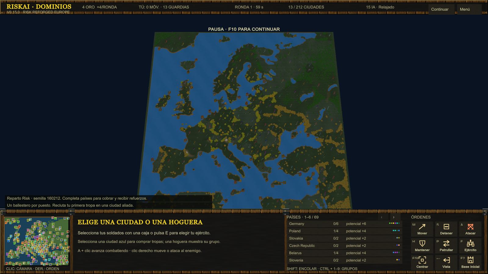

# RiskAI · v0.15

Prototipo RTS de conquista por ciudades, inspirado en los mapas Risk de Warcraft III. Unity 6.3 LTS (6000.3.23f1), URP, partida local contra IA y arte propio/CC0.

Abre **Play-RiskAI.cmd** para jugar la compilación local. El menú permite elegir escenario, 2–16 jugadores, reparto, semilla y dificultad antes de empezar. Al clonar el repositorio, genera primero el ejecutable con `scripts/Unity.ps1 -Action Build`. Las compilaciones y las referencias de Warcraft quedan fuera de Git.

Esta versión permite **un jugador y hasta 15 IA independientes**. Europe (212 ciudades) y New World (293) conservan distancias y coordenadas fuente con una conversión común de unidades, límites W3I y árboles DOO. Ballestero, guardia, sanador y mortero usan colisiones verificadas y alturas de espera calibradas contra medidas numéricas de los modelos originales. Sus siluetas son distintas y el tamaño de los edificios propios aún no está calibrado. [Escala y límites](docs/MAP-SCALE-v0.15.md) · [Cambios](docs/ITERATION-v0.15.md) · [Validación](docs/VALIDATION-v0.15.md) · [Pendientes](TODO.md).



[New World](docs/images/v0.15-newworld.png) · [Panel de 16 jugadores](docs/images/v0.15-players.png) · [Suroeste de Las Marcas](docs/images/v0.14-southwest.png)

## Escenarios

| Mapa | Ciudades y grupos | Terreno |
| --- | --- | --- |
| Las Marcas | 18 ciudades, 9 grupos de 2 | Dos mesetas, costas, río, dos islas y nuevo secano al suroeste. |
| Cuatro Riberas | 20 ciudades: 4 grupos continentales y un archipiélago; 4 ciudades por grupo | Más espacio, río largo desde la montaña meridional, dos cruces y tres islas. |
| Europe · Saran | 212 ciudades, 69 grupos; 44 ciudades portuarias incluidas | Geografía europea y mediterránea extraída de Risk Reforged v3 de Saran. |
| New World | 293 ciudades, 100 grupos; 59 ciudades portuarias incluidas | Europa y América, según Risk New World v3; no cubre todo el planeta. |

Los postes indican fronteras y propietario. Selecciona una **hoguera** para mostrar su área y las ciudades que incluye. Los refuerzos de ese grupo aparecen en la hoguera. Los biomas y el relieve mantienen sus colores; la superposición territorial desaparece al cambiar la selección.

## Primera partida y reglas

**Ciudades al azar** asigna el mismo número de ciudades a cada jugador mediante una semilla; el resto queda neutral. Con 16 jugadores, Europe da 13 ciudades por bando y deja 4 neutrales; New World da 18 y deja 5. En los dos escenarios originales, los puertos adicionales se reparten por separado entre jugadores elegidos por semilla. Cada ciudad y puerto, también los neutrales, empieza con **un ballestero retenido en su círculo**. Todos reciben **4 de oro**, sin tropas móviles ni barcos gratuitos. El menú permite reducir el número de jugadores para los mapas pequeños.

Para empezar, selecciona una ciudad azul (**F2**) y compra un ballestero (**W**) o espadachín (**Q**). La tropa entrenada puede salir a conquistar; **E** selecciona las tropas móviles. Los barcos se compran en un puerto azul (**F3**). También puedes elegir grupos completos o posiciones fijas; el número de puestos neutrales depende del mapa y del modo. La base inicial sirve de referencia para la cámara y el despliegue.

Cada ciudad y puerto tiene un círculo con un defensor retenido. Conserva su tipo, salud y capacidad de ataque; no puede marcharse ni embarcar. Al morir, el aliado elegible más próximo dentro de 4,43 unidades asume la defensa; si no hay aliado, lo hace el enemigo más próximo dentro de 6. Sin candidato, el edificio queda neutral. Se excluyen tropas de otra guarnición y de otra altura. El círculo mide 1,55 de radio; la sucesión se resuelve en el siguiente tick, sin espera adicional.

Las **torres son permanentes** y cambian con el edificio. Para tomar una posición, elimina al defensor y sus relevos cercanos. Una torre ocupada dispara 81–88 de daño perforante cada 0,9 s, con alcance 13. Es un ajuste local de defensa; el búnker original de Saran tiene otros valores, conservados y documentados por separado. Daño final según tipo de ataque, coraza y armadura. Los proyectiles perforantes tienen 25 % de fallo al subir al menos 2,5 unidades; este umbral local evita penalizar pequeñas ondulaciones.

Cada 60 s recibes **4 de base + 1 por ciudad de un grupo totalmente controlado**. Los grupos fragmentados no aportan ingreso de ciudades. Los grupos completos generan ballesteros: uno por ronda en los grupos de dos ciudades de Las Marcas, dos en los de cuatro de Cuatro Riberas. La cantidad sigue `ceil(ciudades / 2)`; está limitada a cinco puntos de unidades vivas por ciudad del grupo. La tanda aparece de una vez: el goteo del script original sigue pendiente. Perder una ciudad suspende nuevas tandas e ingresos; las bajas liberan capacidad. Las recompensas de combate acumulan un cuarto del valor de puntos de la víctima, conservando fracciones hasta completar oro.

| Unidad | Oro | Vida | Función |
| --- | ---: | ---: | --- |
| Espadachín | 1 | 200 | Primera línea |
| Ballestero | 1 | 200 | Daño perforante a distancia |
| Guardia real | 5 | 650 | Infantería pesada |
| Mago | 4 | 250 | Daño mágico de área |
| Mortero | 3 | 350 | Asedio a larga distancia, alcance mínimo 5 |
| Sanador | 2 | 250 | Cura aliados con línea de visión |
| Fragata | 5 | 400 | Combate naval y costero |
| Transporte | 2 | 300 | Seis plazas, sin ataque |

Todas están disponibles directamente en su ciudad o puerto. Las ciudades tienen cola de cinco y los puertos de tres; cancelar devuelve el precio. Tope por bando: 100 soldados, incluidos embarcados y compras pendientes, y 12 barcos. En Europe y New World las guarniciones quedan fuera del tope de 100 para permitir reclutar con más de cien defensores iniciales. En esos mapas los puertos forman parte de las ciudades, grupos, ingresos y victoria, y comparten su defensor y torre. En Las Marcas y Cuatro Riberas siguen siendo puestos navales independientes que no cuentan como ciudades. El reparto naval y los tiempos de producción siguen siendo adaptaciones del prototipo.

Ganas conservando el 60 % de las ciudades durante 20 s: 11 en Las Marcas, 12 en Cuatro Riberas, 128 en Europe o 176 en New World. También vence el último jugador con puestos o tropas: eliminar a una sola IA no termina una partida con más rivales. La IA relajada retrasa su ofensiva, pero ambas dificultades reaccionan para defender bases amenazadas. Todavía no hay niebla de guerra; la IA conoce el mapa completo y no prepara desembarcos.

## Controles

| Acción | Control |
| --- | --- |
| Seleccionar / añadir | Clic izquierdo o caja / Shift |
| Mover, atacar o seguir | Clic derecho y soltar |
| Mover cámara | Arrastrar con botón derecho o central; flechas o bordes |
| Zoom / centrar selección | Rueda / Espacio |
| Avanzar atacando / patrulla | A + clic / P + clic |
| Detener / mantener | S / H |
| Ejército / flota | E / N |
| Base inicial / puerto | F2 / F3 |
| Comprar unidades en ciudad | Q, W, D, F, R, C; o botones |
| Comprar fragata / transporte | Q / W en un puerto |
| Embarcar / desembarcar | B / D con transporte seleccionado |
| Navegar y desembarcar al llegar | Clic derecho sobre un muelle |
| Guardar / recuperar grupo | Ctrl + 1…9 / 1…9 |
| Encolar órdenes | Shift + orden |
| Ver grupo territorial | Clic en su hoguera |
| Pausa / menú | F10 / F1 |
| Liberar cursor / restablecer cámara | Esc / Retroceso |
| Salir | Alt + F4 |

Arrastrar con botón derecho cancela su orden al soltar. El zoom conserva el punto bajo el cursor. El minimapa permite centrar con clic izquierdo y ordenar con el derecho. Una ciudad seleccionada usa clic derecho sobre terreno para fijar su reunión.

## Desarrollo

Abre **Open-Unity.cmd** o añade `RiskAI/` a Unity Hub. Escena: `Assets/RiskAI/Scenes/LasMarcas.unity`. Con el editor cerrado:

```powershell
.\scripts\Unity.ps1 -Action Test       # Reglas en EditMode
.\scripts\Unity.ps1 -Action PlayTests  # Batallas reales, navegación e input
.\scripts\Unity.ps1 -Action Build      # Builds/Windows-v0.15/RiskAI.exe
```

Ejecuta una operación Unity por proyecto a la vez. Informes: `TestResults/`; logs: `RiskAI/Logs/`. El ejecutable acepta `--riskai-seed 701` y `--riskai-map classic`, `riverlands`, `europe` o `newworld`. [Estructura del código](RiskAI/README.md).

`RiskAI.Core` no depende de Unity. `BattleWorld` ordena ticks a 20 Hz; `CombatWorld` resuelve proyectiles sin depender de su vista; hay consultas espaciales y pools. NavMesh y actores aún usan Unity: no se garantiza replay determinista. Los comandos por ID cubren infantería; faltan compras y naval antes de un servidor autoritativo. El HUD sigue usando IMGUI. Touch, Web, Android, multijugador, niebla, guardado y diplomacia siguen pendientes en [TODO.md](TODO.md). No hay un benchmark que acredite cientos o miles de unidades.

## Referencias y arte

Saran Reforged v3 es la referencia de reglas principal; New World es otra variante, y las capturas de Rome no equivalen a disponer de su código. Las Marcas y Cuatro Riberas son escenarios originales. Europe y New World importan datos numéricos de geografía y colocación; el arte y las adaptaciones de navegación son propios. [Auditoría v0.12](docs/RISK-RULES-v0.12.md), [mapas y posiciones](docs/RISK-MAPS-v0.10.md), [datos heredados](docs/REFORGED-BASE-STATS-v0.9.md) y [lecciones de World Editor para el terreno](docs/WORLD-EDITOR-TERRAIN.md).

El juego distribuye arte propio y KayKit CC0. No incluye modelos, texturas, sonidos, discos ni claves de Warcraft. [Créditos y licencias](THIRD_PARTY_NOTICES.md). El prototipo web descartado y los mapas de investigación están en referencias locales ignoradas; `Resources/Maps/` contiene las dos geografías jugables y su procedencia; `data/derived/` conserva los informes de extracción; los perfiles efectivos siguen en C#. El antiguo `data/rules.json` está retirado y remite a esas fuentes, sin duplicar estadísticas.
