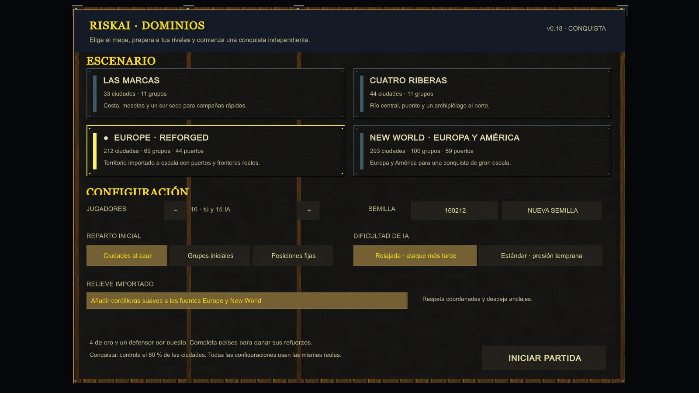
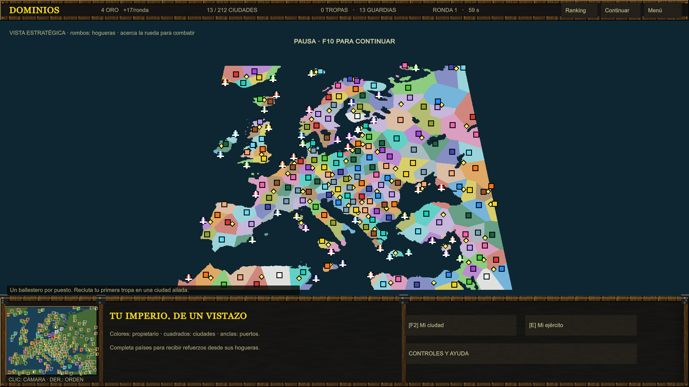
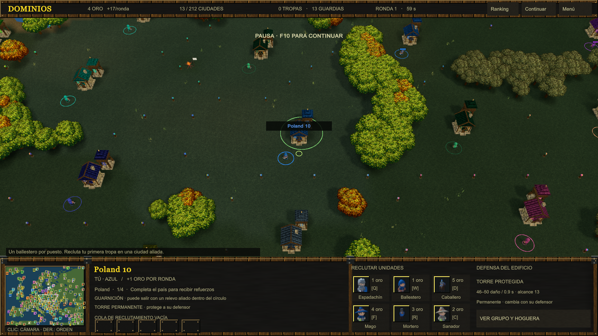
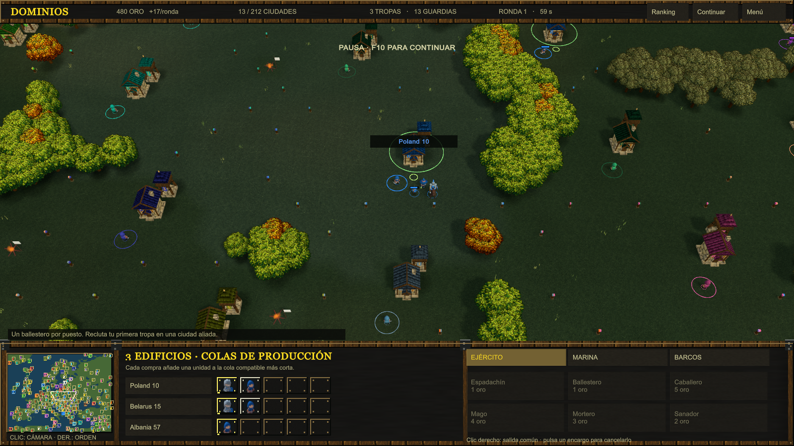
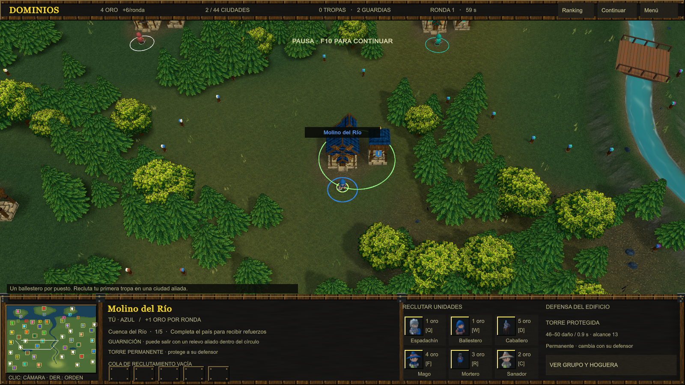

# RiskAI · v0.18

Prototipo RTS local de conquista por ciudades, inspirado en mapas Risk de Warcraft III. Unity 6.3 LTS (6000.3.23f1), URP y arte propio/CC0. Abre **Play-RiskAI.cmd** para jugar la compilación local. Al clonar el repositorio, genera primero el ejecutable con `scripts/Unity.ps1 -Action Build`.

La configuración vive en una escena inicial separada: permite elegir los cuatro mapas, 2–16 jugadores, reparto, semilla y dificultad sin crear terreno, NavMesh ni una sesión. Al pulsar **Iniciar** carga Las Marcas y aplica la configuración elegida. Las capturas y pruebas automatizadas omiten esa pantalla.



## Escenarios y reglas comunes

| Mapa | Ciudades y grupos | Terreno |
| --- | --- | --- |
| Las Marcas | 33 ciudades, 11 grupos | Mesetas, costa, río, islas y secano al suroeste. |
| Cuatro Riberas | 44 ciudades, 11 grupos | Río largo, cruces, islas y claros irregulares. |
| Europe · Saran | 212 ciudades, 69 grupos; 44 ciudades portuarias incluidas | Geografía europea y mediterránea de datos importados. |
| New World | 293 ciudades, 100 grupos; 59 ciudades portuarias incluidas | Europa y América de datos importados. |

Los cuatro mapas comparten ángulo, zoom inicial, mínimo, sensibilidad, cámara estratégica y sus reglas de partida. El encuadre máximo depende de la extensión geográfica y del espacio disponible bajo el HUD. La vista estratégica oculta detalle táctico y proyecta territorios y puertos sobre el suelo existente; la simulación, navegación y colisiones siguen activas. La transición tiene histéresis para que la rueda no alterne junto al umbral.



Cada jugador empieza con 4 de oro. Las ciudades al azar reparten el mismo número por equipo y dejan el resto neutral. Cada ciudad y puesto tiene un defensor retenido. Una guarnición sólo puede salir si un aliado elegible dentro de su círculo toma el relevo; una orden inválida conserva al defensor. Los barcos mantienen su propia prioridad de sucesión en el atraque marítimo.

El límite es uniforme: **100 tropas móviles por equipo**, excluidas las guarniciones, en todos los escenarios. Los encargos pendientes cuentan para ese límite. La victoria exige mantener `ceil(ciudades × 0,60)` durante 20 s: 20 ciudades en Las Marcas, 27 en Cuatro Riberas, 128 en Europe y 176 en New World. El último jugador con puestos o tropas también vence; eliminar a una IA no concluye una partida con más rivales.

Los países completos reciben créditos de refuerzo y sus unidades aparecen en la hoguera. Sin salida asignada, esperan allí; clic derecho en terreno fija el punto de salida. Los puestos de frontera muestran propietario y la inspección de una hoguera dibuja su territorio y los puertos miembros.

Cada 60 segundos, conservar al menos una ciudad concede 4 de oro base más 1 por ciudad propia. Cada país completo recibe `ceil(ciudades / 2)` créditos de ballesteros; emite uno cada 0,5 segundos, con un máximo de cinco puntos vivos por ciudad del país. Las torres permanentes del puesto usan 46–50 de daño perforante, 0,9 segundos de cadencia y alcance 13. [Reglas y costes](docs/RISK-RULES-v0.16.md) · [Counters](docs/audits/COUNTERS-v0.17.md) · [Escala y procedencia de mapas](docs/MAP-SCALE-v0.15.md).

## Selección, colas y estrategia

La caja de selección prioriza tropas móviles y, cuando no las contiene, permite seleccionar edificios. Shift añade. Un doble clic en una ciudad propia agrupa ciudades propias cercanas y visibles. Casa y torre remiten al mismo puesto y el anillo de selección cubre su huella. Los puertos importados conservan una única identidad de selección.

La selección múltiple muestra las colas de cada edificio y permite cancelar encargos concretos. Una compra añade una unidad total a la cola compatible más corta; no multiplica coste ni unidades por los edificios seleccionados. Las ciudades y los puertos mantienen colas independientes de tierra y mar.





| Acción | Control |
| --- | --- |
| Seleccionar / añadir | Clic izquierdo o caja / Shift |
| Mover, atacar o seguir | Clic derecho y soltar |
| Mover cámara | Arrastrar con botón derecho o central; flechas o bordes |
| Zoom / centrar selección | Rueda / Espacio |
| Avanzar atacando / patrulla | A + clic / P + clic |
| Detener / mantener | S / H |
| Ejército / flota | E / N |
| Base inicial / puerto | F2 / F3 |
| Comprar unidades en ciudad | Q, W, D, F, R, C; o botones |
| Comprar fragata / transporte | Q / W en un puerto |
| Embarcar / desembarcar | B / D con transporte seleccionado |
| Guardar / recuperar grupo | Ctrl + 1…9 / 1…9 |
| Ver grupo territorial / fijar salida | Clic en hoguera / clic derecho en terreno |
| Marcadores | Mantener Tab |
| Pausa / menú | F10 / F1 |

## Perfiles, arte y mapas

Los perfiles compartidos incluyen los tiempos de preparación de ataque comprobados en las fuentes locales; el backswing queda como metadato y no crea un bloqueo de movimiento inventado. El soldado local no se presenta como una unidad extraída de Europe. La evidencia y los campos aún no resueltos están en la [auditoría de combate v0.18](docs/audits/v0.18-combat-source.md).

La actividad de entrenamiento ilumina la entrada existente de cada edificio. El caballero usa una embestida de lanza; el mortero es un artillero a pie con cañón corto y proyectil arqueado; los impactos distinguen perforación, magia y asedio mediante efectos reutilizados y acotados. Las Marcas y Cuatro Riberas son escenarios originales; Europe y New World conservan sus coordenadas y cantidades importadas. No se distribuyen assets de Warcraft.



## Desarrollo

Abre **Open-Unity.cmd** o añade `RiskAI/` a Unity Hub. La batalla está en `Assets/RiskAI/Scenes/LasMarcas.unity`; la escena de inicio se prepara como índice 0. Con el editor cerrado:

```powershell
.\scripts\Unity.ps1 -Action Test       # Reglas en EditMode
.\scripts\Unity.ps1 -Action PlayTests  # Batallas reales, navegación e input
.\scripts\Unity.ps1 -Action Build      # Builds/Windows-v0.18/RiskAI.exe
```

Ejecuta una operación Unity por proyecto a la vez. Informes: `TestResults/`; logs: `RiskAI/Logs/`. El ejecutable acepta `--riskai-seed 701` y `--riskai-map classic`, `riverlands`, `europe` o `newworld`.

La v0.18 tiene build Windows, 171 casos Unity aprobados y 7 pruebas Python. Las sondas incluyen una partida avanzada de 16 jugadores y una carga de hasta 660 unidades; registran respuesta a órdenes, tiempos de fotograma y coste naval. Persisten esperas de navegación y picos: [mediciones y límites](docs/VALIDATION-v0.18.md). [Cambios v0.18](docs/ITERATION-v0.18.md) · [Estructura del código](RiskAI/README.md) · [Diagnóstico en vivo](docs/OBSERVABILITY.md) · [Pendientes](TODO.md).

## Referencias y licencias

`RiskAI.Core` no depende de Unity. `BattleWorld` ordena ticks a 20 Hz; `CombatWorld` resuelve impactos sin depender de la vista; NavMesh y actores aún usan Unity y no garantizan replay determinista. Touch, Web, Android, multijugador, niebla, guardado y diplomacia siguen pendientes.

El juego distribuye arte propio y KayKit CC0. No incluye modelos, texturas, sonidos, discos ni claves de Warcraft. [Créditos y licencias](THIRD_PARTY_NOTICES.md). Las referencias de investigación y compilaciones quedan fuera de Git.
