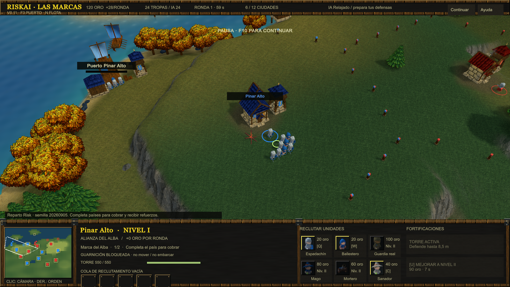

# RiskAI — Las Marcas · v0.11

Prototipo de conquista territorial en **Unity 6.3 LTS (6000.3.23f1), C# y URP**. Partida local contra una IA sencilla, con soldados controlables y rondas económicas mientras la acción continúa.

## Jugar

Doble clic en **Play-RiskAI.cmd**. Inicia `Builds/Windows-v0.11/RiskAI.exe` en una ventana de 1600 × 900. No hace falta abrir el editor para jugar.

Si acabas de clonar el repositorio, genera primero ese ejecutable con `scripts/Unity.ps1 -Action Build` o con **RiskAI > Build Windows prototype** en Unity. Los ejecutables y las referencias de Warcraft no se incluyen en Git.

**Novedades v0.11:** simulación a 20 Hz, proyectiles independientes del efecto visual, guarniciones retenidas, captura breve con protección cercana y torres que cambian con el edificio. Pools de soldados/efectos y consultas espaciales. [Cambios, revisión de arquitectura y límites](docs/ITERATION-v0.11.md).



Para desarrollar, usa **Open-Unity.cmd** o añade la carpeta `RiskAI` a Unity Hub. Abre `Assets/RiskAI/Scenes/LasMarcas.unity` y pulsa Play.

## Controles

| Acción | Control |
| --- | --- |
| Seleccionar soldados | Clic izquierdo o arrastrar una caja |
| Añadir a la selección | Shift + selección |
| Mover / atacar enemigo | Clic derecho |
| Avanzar atacando | A, después clic izquierdo |
| Conquistar | Clic derecho sobre una ciudad enemiga o neutral |
| Detener / mantener posición | S / H |
| Patrullar / seguir aliado | P + clic / clic derecho en aliado |
| Seleccionar todo tu ejército | E |
| Puerto / flota | F3 / N |
| Comprar galera / transporte en puerto | Q / W |
| Embarcar / desembarcar | B / D, con transporte seleccionado |
| Navegar y desembarcar al llegar | Clic derecho sobre un muelle |
| Reclutar espadachín / ballestero | Q / W, o botones de la ciudad |
| Reclutar guardia real / mago / mortero | D / F / R; requieren ciudad de nivel II |
| Reclutar sanador | C; disponible desde nivel I |
| Construir torre / mejorar ciudad | T / U, o botones de la ciudad |
| Guardar / recuperar grupo | Ctrl + 1…9 / 1…9 |
| Encolar destinos | Shift + orden |
| Mover cámara | Flechas, bordes de pantalla o arrastrar con botón central |
| Zoom / centrar selección | Rueda / Espacio |
| Volver a tu capital y abrir compras | F2 |
| Minimap | Clic centra cámara; clic derecho da una orden |
| Pausa / ayuda | F10 / F1 |
| Restablecer cámara / ver vidas | Retroceso / mantener Alt |
| Reiniciar / elegir modo | Ayuda > reparto y semilla > Empezar Conquista / Capitales |
| Salir | Alt + F4 |

Selecciona una ciudad propia y haz clic derecho en el terreno para cambiar su punto de reunión. Sin ciudad seleccionada, Q/W usan la primera que poseas.

Al seleccionar soldados, la cuadrícula de iconos de la derecha muestra las órdenes. El panel de países indica ciudades controladas e ingresos potenciales; pulsa un país para localizar una ciudad pendiente. Su descripción muestra el tipo de refuerzo y su límite.

## Primera partida

El inicio principal **Reparto Risk** distribuye las doce ciudades al azar: seis por bando, con una capital y 24 soldados cada uno. Empiezas en azul con 120 de oro. F1 permite cambiar la semilla y repetir el reparto, elegir Conquista o Capitales, o empezar con **Países iniciales**: un país completo por bando y ocho ciudades neutrales. **Práctica** conserva las posiciones fijas anteriores.

Las doce ciudades forman seis países y tres regiones. Completar países importa aunque empieces con varias ciudades dispersas. El mundo mide aproximadamente 202 × 235 unidades, con más mar al norte y dos islas. Los postes delimitan territorios con el color del propietario de cada ciudad vecina; el terreno se pinta por bioma y relieve. No hay grandes nombres sobre el terreno. Hay costa arenosa, pradera, barro, musgo, grava, afloramientos de caliza y dos mesetas con rampas. Los acantilados impiden caminar directamente entre alturas.

Cada ciudad y puerto tiene un círculo de ocupación de radio 1,1. Su defensor queda retenido como guarnición, conserva tipo y salud y combate sin abandonar el puesto. Cuando cae, los soldados del propietario a menos de 2,8 siguen bloqueando la captura. El mismo atacante debe permanecer 1,25 s en el círculo sin oposición para conquistar; salir o volver a quedar disputado reinicia la transición. La torre cambia con el edificio conservando su vida. La guarnición no puede recibir órdenes de marcha ni embarcar.

Cada 60 segundos cobras 12 de base más los ingresos de tus países completos: cada una de sus ciudades aporta 8 de oro, más 6 si es de nivel II. Una ciudad aislada no aporta ingresos hasta completar su país. Controlar toda una región añade su bonus: Alba +8, Paso del Rey +12, Frontera Carmesí +8. En Reparto Risk, el ingreso inicial depende de los países que te haya dado el reparto; la base garantizada es 12.

Cada país completo también genera refuerzos gratuitos en cada ronda. Marca del Alba, Paso del Rey y Ceniza dan dos espadachines; Valdeluz un ballestero; Ribera Gris un mago; Las Atalayas un guardia real. Cada país permite mantener vivas cinco tandas de sus refuerzos (10 espadachines o 5 unidades del otro tipo). Las bajas liberan capacidad; la reposición continúa después de la quinta ronda. Perder una ciudad interrumpe sus ingresos y nuevos refuerzos, sin borrar las tropas ya creadas.

Reclutar cuesta 20 oro / 3 s para espadachines, 20 / 4 s para ballesteros y 40 / 4 s para sanadores. Nivel II desbloquea guardias (100 / 5,5 s), magos (80 / 6 s) y morteros (60 / 6 s). Cola de cinco; cancelar devuelve el coste. Límite de 100 soldados por bando, incluidos embarcados y compras pendientes.

Todas las ciudades y puertos empiezan con torre. Reconstruirla cuesta 60 oro / 7 s: 550 vida, 51–58 daño perforante cada 1,5 s, armadura fortificada 3, alcance 8,5. El mortero dispara entre 5 y 18 y usa daño de asedio. El sanador cura 15 vida/s a aliados terrestres heridos dentro de 8 con línea de visión. Los ataques tiran dados; el resultado se modifica por tipo de ataque, coraza y armadura numérica. Los perfiles y sus fuentes están en [ITERATION-v0.10](docs/ITERATION-v0.10.md). Mejorar una ciudad cuesta 90 oro / 7 s y añade 6 oro/ronda si controlas el país. Las bajas enemigas dan 2 oro.

En **Conquista**, ganas conservando ocho ciudades (60 % redondeado hacia arriba) durante 20 segundos. En **Capitales**, ganas capturando la capital inicial enemiga. En ambos modos también puedes vencer eliminando todas las ciudades y soldados del rival. Elige el modo al iniciar otra partida desde Ayuda. La IA tranquila viene seleccionada: compra como máximo una unidad cada 12 s desde el segundo 30 y organiza ofensivas desde el segundo 120. F1 permite elegir Estándar para la siguiente partida. Ambos bandos tienen los mismos recursos iniciales; tres soldados existentes se sitúan en cada muelle, además de las guarniciones de ciudades y puertos. Las guarniciones usan población existente y reducen el ejército móvil. La barra muestra tu población y la enemiga.

## Islas y barcos

Cada bando recibe una galera y un transporte. F3 centra el puerto; hay tres soldados junto al muelle preparados para embarcar. Selecciona el transporte, pulsa B y haz clic derecho en un puerto insular para navegar y desembarcar. La infantería ocupa el círculo insular durante 1,25 s sin oposición, deja una guarnición y produce +8 oro por ronda. Los puertos continentales también se capturan por separado de su ciudad asociada. Estos dos puestos son objetivos económicos adicionales y todavía no cuentan para la victoria por ciudades.

Los astilleros venden galeras (75 oro, 500 vida) y transportes (45 oro, 300 vida, seis plazas). La cola admite tres barcos y reembolsa cancelaciones y encargos de puertos conquistados. Hay un máximo de doce barcos por bando. Las galeras atacan barcos y objetivos costeros con línea de visión; la IA naval patrulla con galeras, pero aún no prepara desembarcos. Las reglas adaptadas y el arte original están en [docs/ITERATION-v0.10.md](docs/ITERATION-v0.10.md).

## Desarrollo y CLI

La CLI instalada está en `C:\Program Files\Unity Hub\resources\cli\unity.exe`. El editor está registrado en Hub y el proyecto incluye Unity Pipeline para automatizar el editor.

Con el editor cerrado, desde PowerShell en esta carpeta:

```powershell
.\scripts\Unity.ps1 -Action Test       # Reglas en EditMode
.\scripts\Unity.ps1 -Action PlayTests  # Navegación, reclutamiento y combate reales
.\scripts\Unity.ps1 -Action Build      # Ejecutable Windows
.\scripts\Unity.ps1 -Action Open       # Abrir editor
```

Los informes se escriben en `TestResults/` y los registros en `RiskAI/Logs/`. La estructura de C# está descrita en [RiskAI/README.md](RiskAI/README.md).

[Validación v0.11](docs/VALIDATION-v0.11.md): pruebas de reglas, simulación, captura, navegación, cámara y aislamiento de presentación, más compilación e inspección del ejecutable.

## Alcance de esta v0.11

Los personajes medievales y sus animaciones usan KayKit Adventurers (CC0). El paisaje usa atlas pintados originales, edificios y torres con tejados de facción, abeto de ramas recortadas y terrenos que mezclan pradera, arena, barro, musgo, grava, pizarra y caliza. Hay humo de chimeneas, hogueras, aves, estandartes y molino animados, juncos y un río tallado que baja desde la montaña hasta el mar. La cámara conserva perspectiva con inclinación de 49° y orientación diagonal de 30°. El zoom responde a pasos normalizados de rueda, suaviza la transición y mantiene el punto bajo el cursor también en altura; las órdenes reconocen el terreno elevado. La selección se centra en el área visible por encima del HUD. F1 ofrece velocidad de cámara ajustable y desplazamiento por bordes; salir de la ventana cancela el arrastre central para evitar saltos.

La simulación usa un tick fijo, comandos de infantería por ID y reglas en un ensamblado sin Unity. NavMesh y los actores todavía usan Unity; no se garantiza replay determinista. Esta entrega permite comprobar control, rutas, ritmo y conquista; la economía está adaptada a este escenario pequeño y requiere feedback. Todavía faltan arte definitivo, audio, niebla de guerra, guardado, multijugador, diplomacia y trabajo de rendimiento a gran escala. No se ha medido una capacidad de cientos o miles de unidades.

El proyecto activo es `RiskAI/`. El intento web descartado queda archivado en `references/discarded-web-prototype/` y no forma parte del juego. Los JSON de `data/` son bocetos de diseño; las reglas efectivas de esta v0 están en `BattleRules.cs`, `Core/ReforgedProfiles.cs`, `CityClaimZone.cs` y la distribución en `MapLayout.cs`, el terreno en `StrategicTerrain.cs` y el arranque en `RiskBootstrap.cs`.

## Referencias

Los archivos extraídos son Saran v3 y New World v3.0; las capturas de referencia son de **Risk Reforged: Rome**, otra variante cuyo mapa verificable no se ha obtenido. No se mezclan sus estadísticas como si fueran el mismo juego. [Coordenadas y auditoría de mapas](docs/RISK-MAPS-v0.10.md), [herencia de unidades y dados](docs/REFORGED-BASE-STATS-v0.9.md) y [captura por defensor](docs/CAPTURE-SOURCE-v0.9.md).

Risk Reforged / Devolution sirve como referencia de diseño. Se extrajo el script JASS del mapa editable v3.0 para estudiar captura, países, ingresos y refuerzos, sin extraer sus texturas ni modelos. Las reglas están documentadas en [la auditoría de Reforged](docs/RISK-REFORGED-RULES.md), [reparto inicial](docs/REFORGED-ALLOCATION.md) y [unidades y daño](docs/REFORGED-UNIT-STATS.md). Las texturas nuevas y sus prompts constan en [ImageGen v0.7](docs/IMAGEGEN-v0.7.md). Dos cálculos puros de otra implementación, [Risk Europe](docs/RISK-EUROPE-RULES.md), se adaptaron a C# bajo licencia MIT: capacidad de refuerzos y umbral de victoria. Véase [THIRD_PARTY_NOTICES.md](THIRD_PARTY_NOTICES.md). La navegación usa Unity; los modos y el equilibrio de esta v0 son una adaptación, no una reproducción completa del mapa.

[Procedencia de las referencias](references/SOURCES.md) · [Investigación inicial y elección de motor](references/ENGINE_RESEARCH.md).


