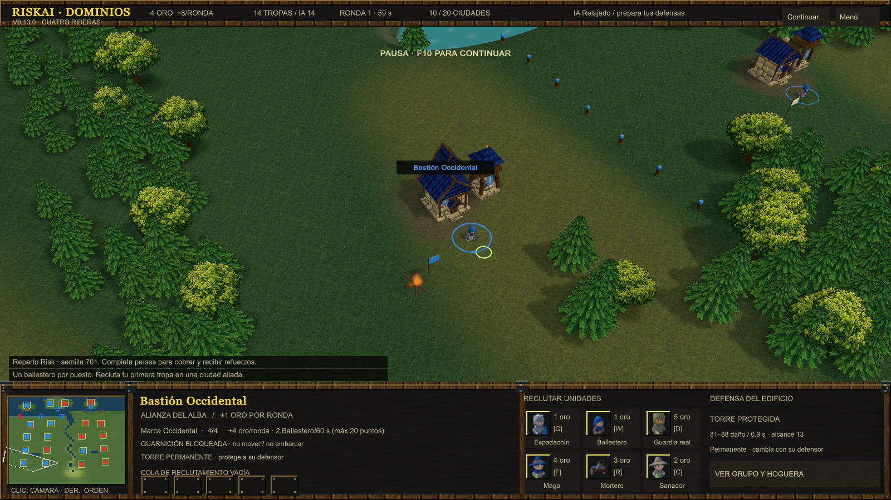
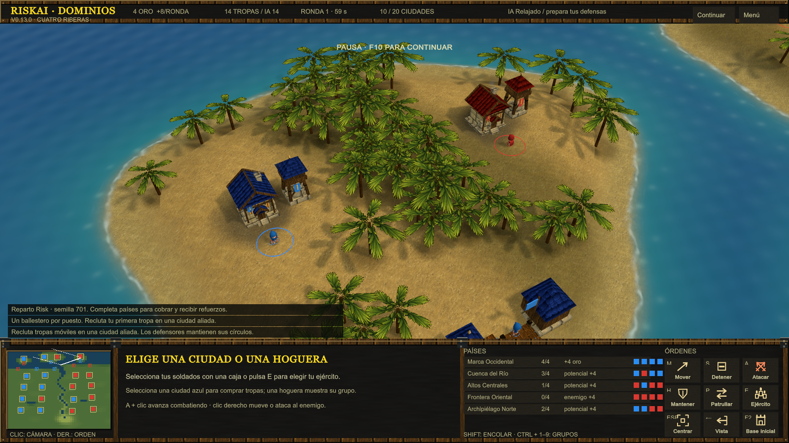

# RiskAI v0.13 — apertura por guarniciones

El prototipo comenzaba con ejércitos y barcos gratuitos que no corresponden al inicio normal de Saran Reforged v3. Ahora cada ciudad y puerto empieza con un solo ballestero retenido en el círculo; las tropas móviles y flotas se compran. Conserva los dos escenarios originales, la economía de 4 de oro inicial y la sucesión de defensores de v0.12.

## Cambios jugables

- **Las Marcas:** 12 ciudades y 7 puertos = 19 defensores. Con ciudades al azar: 9 por bando y 1 neutral. **Cuatro Riberas:** 20 ciudades y 8 puertos = 28 defensores, 14 por bando con ese reparto. Los modos fijo/grupos tienen más neutrales. Los puertos se reparten por una segunda semilla equilibrada y permanecen independientes.
- **Primera orden:** F2 selecciona una ciudad propia; W compra ballestero, Q espadachín. E reúne solo soldados móviles. El defensor conserva su puesto. Mensaje de inicio y menú explican esta apertura.
- **IA:** primera compra asequible, secuencia de reclutamiento por compras exitosas, prioridad de ciudad amenazada/frontera, ofensiva compatible con dos/tres móviles y reserva de uno a partir de cuatro. Mantiene los tiempos de gracia. Cuando puede, ahorra para la primera fragata y la paga mediante la misma cola del puerto que el jugador; nunca aparece gratis.
- **Hogueras:** un ballestero por ronda en grupos de dos ciudades; dos en grupos de cuatro. Corresponde a `ceil(ciudades/2)`, con el límite existente de cinco puntos vivos por ciudad del grupo. La emisión de una tanda completa sigue siendo una adaptación: el JASS original usa una cola y un temporizador de goteo.
- **Aproximación a distancia:** con línea de visión y un tramo transitable directo, la ruta termina en una posición de tiro próxima al alcance útil. La persecución anterior apuntaba al enemigo y dependía de un radio de frenada que podía sobrepasarse entre ticks; se reprodujo a 10 FPS y velocidad ×4. Se conserva la búsqueda de una ruta más cercana si la posición de tiro está obstruida. Esto no añade evasión automática de torres: el ángulo elegido debe tener terreno transitable.
- **Formación pequeña:** infantería delante y distancia detrás incluso en parejas. Antes ambas compartían una fila.
- **Separación de puestos:** más terreno al norte de las islas y ciudades separadas del puerto. En Las Marcas se recolocan Puerto del Pinar y Puerto del Paso para quedar fuera del alcance de otras guarniciones. La geometría anterior permitía torres disparando a otros defensores iniciales cuando el reparto asignaba bandos distintos. Los muelles insulares y su costa sur conservan su ubicación.
- **Torres:** inspector coherente con el perfil activo y su condición permanente. Se eliminó texto antiguo que decía que eran destructibles y mostraba otros valores.
- **Bosques y captura:** incorpora el hotfix v0.12 que reserva claros según copas proyectadas ante la cámara y oculta barras fuera de una captura real.

## Referencia y táctica comprobable

La extracción JASS confirma un `h00B` por ciudad normal o portuaria, incluidas neutrales, y cero barcos iniciales en Conquista normal. El documento [de economía inicial](audits/INITIAL-ECONOMY-v0.13.md) distingue esta regla de nuestras arenas y adaptaciones.

La prueba `LoneArcherCanApproachFromFarSideKillGuardAndClaimWithoutTowerFire` hace recorrer a un ballestero el lado opuesto a la torre, matar un defensor **cuerpo a cuerpo** y ocupar su círculo con la misma unidad. No afirma que pueda derrotar sin bajas cualquier guarnición de ballesteros o sus refuerzos. El alcance 8 del ballestero y 13 de la torre permite esa táctica con el desplazamiento del círculo; no fue necesario debilitar otra vez la torre.

`python scripts/extract_risk_circles.py` deriva las coordenadas de los 212 círculos `B00R` y las asocia sin duplicados a las 212 ciudades de Saran. Mediana ciudad/círculo: 286,216701 unidades WC3, o 5,724334 con nuestra escala 50:1; la distancia actual del prototipo es aproximadamente 5,66. JSON numérico y hashes en `data/derived/risk-reforged-v3-circles.json`, sin arte del juego. El parser admite únicamente el formato local verificado y rechaza variantes que no entiende.

## Capturas del ejecutable

## Límites y próximas fases

Los mapas jugables siguen siendo Las Marcas y Cuatro Riberas. Europe y New World todavía no están importados: las coordenadas son preparación para autoría/navegación. En Saran, los puertos cuentan como ciudades dentro del reparto, grupos y victoria; nuestros puertos independientes todavía no. Antes de importar más de 200 puestos habrá que revisar población y generalizar jugadores.

No se reescribió en ECS ni se implementaron héroes, touch, Web/Android o red. [TODO](../TODO.md) conserva selección/progresión de héroes, gestos de uno/dos dedos y lápiz, servidor autoritativo, importación y editor de terreno. La IA conoce el mapa entero y no organiza desembarcos. Los perfiles continúan en C#; `data/rules.json` ahora remite a las fuentes activas y ha dejado de mostrar estadísticas obsoletas.

Las revisiones Qwen sirven de pistas: varios supuestos bugs eran lecturas incorrectas. [Resoluciones verificadas](audits/QWEN-TRIAGE-v0.13.md). [Resultados de pruebas y capturas](VALIDATION-v0.13.md).
