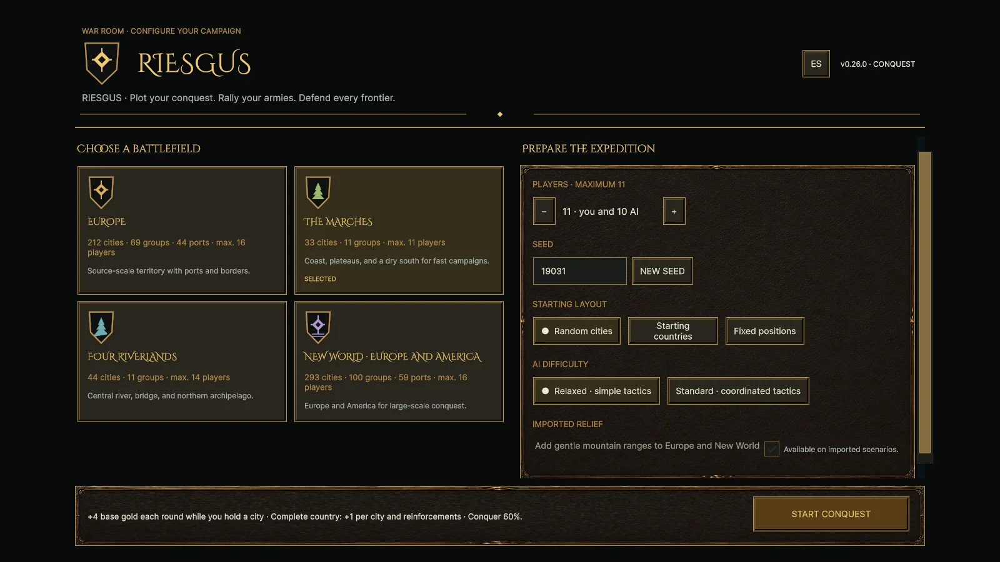
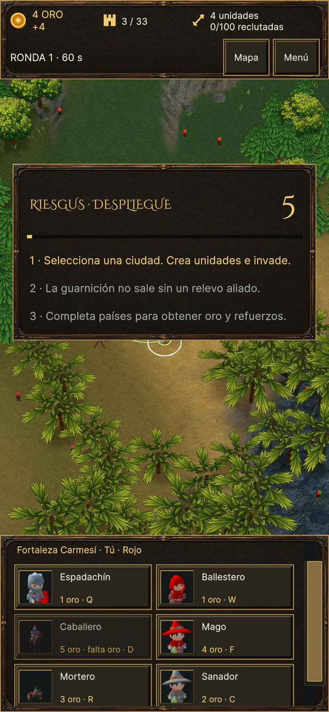

# Riesgus v0.26 · validación del 22 de septiembre de 2026

Publicación: **https://riesgus.com**. `www.riesgus.com` redirige con 301 al
dominio principal y HTTP redirige a HTTPS.

## Cambios

- Nombre visible Riesgus en menú, HUD, carga web, producto Unity y lanzador.
  Los identificadores internos RiskAI se conservan por compatibilidad.
- Menú de campaña independiente del HUD de batalla, controles táctiles de
  al menos 44 píxeles lógicos en la cabecera y panel inferior más compacto.
- Briefing de cinco segundos con los tres consejos visibles simultáneamente,
  en español e inglés. La primera carga gráfica y la vuelta de una aplicación
  suspendida no consumen el tiempo de lectura.
- El texto explica las reglas reales: una guarnición necesita un relevo aliado
  para salir; los países completos generan oro por ciudad y refuerzos.
- Pruebas navales antiguas actualizadas al contrato vigente: la fragata puede
  ocupar un puerto vacío; el transporte no. No se cambió esa regla.

## Verificación

- 150 casos EditMode y 35 casos PlayMode distintos aprobados en las áreas de
  interfaz, arranque y guarniciones. No se ejecutó toda la suite PlayMode.
- 20 pruebas Python y 12 del puente de lápiz aprobadas. Las comprobaciones del
  Worker cubren origen fijo, caché versionada, gzip/MIME, 304, métodos,
  redirecciones y rutas manipuladas.
- Builds Windows y WebGL v0.26 correctas. El lanzador anterior delega en
  `Play-Riesgus.cmd`.
- El proceso de build regenera los retratos existentes. Ocho PNG presentan
  variaciones de render inferiores a 0,21/255 de media, conservando 192×192;
  se mantienen los recursos usados por la build validada.
- Navegador Edge: 1600×900, 1024×768 DPR 2, 390×844 DPR 2 y 844×390 DPR 2.
  Se inspeccionaron menú, briefing y HUD; clic y toque reales inician partida.
- Europe en tablet: selección de ciudad, colas, puertos, mapa estratégico,
  economía y clasificación sin errores; los botones reales abren sus paneles.
- Producción, 390×844 DPR 2: cambio a español, toque de inicio y partida sin
  errores de navegador. Los diez archivos públicos coinciden con el manifiesto
  de despliegue, incluidos los bundles gzip.

El primer test nuevo del briefing se ejecutaba después de empezar la
simulación, cuando comenzar una cuenta atrás ya está correctamente prohibido.
Se corrigió el fixture para iniciar antes del primer tick y pasó. La última
corrección del reloj se volvió a probar y se recompilaron ambas plataformas.

## Publicación y recuperación

- Release Azure: `20260922T015400Z-riesgus-v026`.
- Archivo: SHA-256 `198919f90956733a35e1ea75eec0afeb782f6e54dbaae3a62b39c242ebc83988`.
- Worker `riesgus-web-proxy`, publicado con Wrangler 4.136.1.
- Versión del Worker: `ce61540d-c206-4979-a369-81f47c2f5374`.
- DNS proxied: apex → origen Azure; www → apex. El Worker fija el origen HTTPS
  y atiende las dos rutas. La URL workers.dev queda desactivada en producción.
- Rollback conservado: `/srv/riskai/releases/20260910T014616Z-2997861`.
  El recibo local `.deploy/20260922T015400Z-riesgus-v026/receipt.json` contiene
  los argumentos exactos de recuperación. Los registros DNS previos están en
  `.deploy/riesgus-cloudflare-before.json`.

Los archivos de Unity superan el límite de 25 MiB por archivo de Workers
Assets. Cloudflare sirve como proxy/CDN; Azure continúa alojando la build.
[Configuración y permisos](DEPLOY-RIESGUS-CLOUDFLARE.md).

Los dos tokens temporales se revocaron a las 02:07 UTC. Ambos devolvieron 401
al verificarlos después del borrado; se eliminó también la credencial local
cifrada. El Worker no depende de estos tokens para servir el juego.

## Alcance

Las pruebas móviles usan emulación de tamaño y entrada en un navegador de
escritorio. No certifican rendimiento ni memoria en iPhone/Android o tablet
físicos. Tampoco se ha revalidado en esta ronda el rendimiento con 900 unidades.

Se completaron tres [revisiones de Grok 4.7](audits/GROK-RIESGUS-v0.26.md),
de alcance acotado: gameplay, interfaz y Worker. La interfaz no tuvo defectos
confirmados. Los avisos de compresión y caché se contrastaron y no se
reprodujeron; el posible caso de fallo de orden tras un relevo queda anotado
como mejora de robustez sin reproducción normal demostrada.
