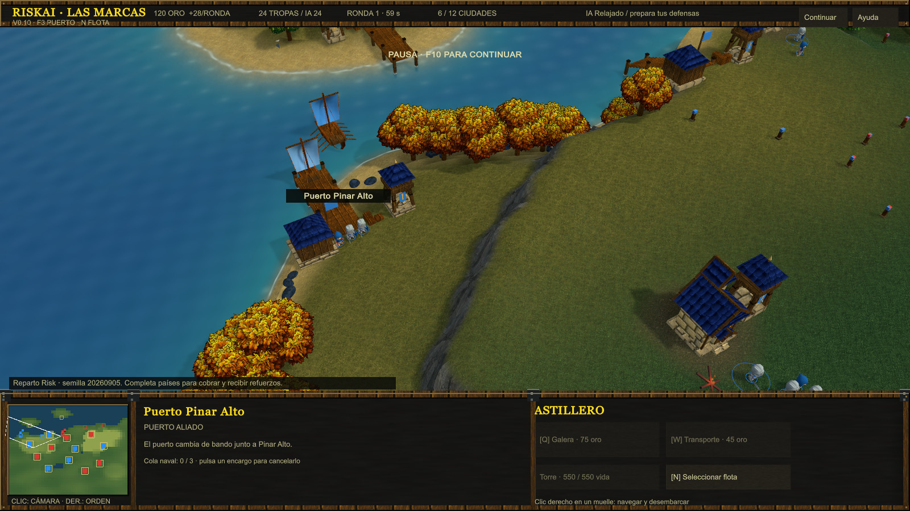
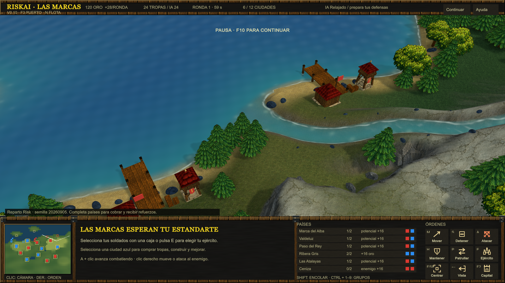

# Validación v0.10

Fecha: 6 de septiembre de 2026. Unity 6000.3.23f1, URP, Windows x64.

## Pruebas de comportamiento

**72 pruebas distintas aprobadas: 17 EditMode y 55 PlayMode.** El recuento PlayMode utiliza el último resultado de cada prueba entre una ejecución completa y las repeticiones dirigidas posteriores; no es una única ejecución final de 55/55.

| Informe local | Resultado | Alcance |
| --- | ---: | --- |
| `TestResults/editmode-v10.xml` | 17/17 | Reglas económicas, perfiles y cálculos puros |
| `TestResults/playmode-v10-release.xml` | 52/55 | Suite completa antes de corregir los tres fallos siguientes |
| `TestResults/playmode-v10-fixes.xml` | 21/21 | Cámara, ritmo de IA, reparto, navegación naval y torres |
| `TestResults/playmode-v10-routes.xml` | 1/1 | Ciudades y rutas terrestres accesibles |
| `TestResults/playmode-v10-water.xml` | 5/5 | Navegación naval y rutas tras corregir el lecho del río |

Los tres fallos de la ejecución completa fueron dos comprobaciones del arranque tranquilo de la IA y la simulación de Escape. Los primeros detectaron un puerto adicional demasiado próximo a una torre neutral: ahora se garantiza un puerto por bando usando los cinco emplazamientos separados. La prueba de Escape creaba el teclado sintético antes de configurar la entrega de eventos en batch; se corrigió el orden y se comprueba que la pulsación llega al sistema de entrada antes de evaluar el controlador.

La cobertura dirigida comprueba desplazamiento por bordes y esquinas, cancelación al perder foco, rueda normalizada y zoom anclado, reconstrucción y daño real de torres, ausencia de fuego contra defensores neutrales, igualdad de población inicial, compras y reembolsos navales, embarque, navegación, desembarco y captura insular. La comprobación del río exige un lecho poco profundo bajo los tramos interiores, además de una pendiente descendente; evita que vuelva a quedar suspendido sobre un valle bajo.

El resumen local `TestResults/v10-validation-summary.json` relaciona las 55 pruebas PlayMode con su último informe. Informes XML y registros están excluidos de Git.

## Ejecutable e inspección visual

La compilación Windows terminó correctamente: `RISKAI_BUILD_OK: 197032445 bytes`, registro `RiskAI/Logs/build-v10-water-final.log`. Ejecutable local: `Builds/Windows-v0.10/RiskAI.exe`; lanzador: `Play-RiskAI.cmd`.

La captura automatizada del Player usa una partida con semilla `20260905`, pausa la simulación y recorre diez encuadres a 1600 × 900: vista general, ciudad, tierras altas, puerto, flota, río, desembocadura, robles, isla y ayuda. Registro: `TestResults/player-capture-v10-water-final.log`. Las capturas de esta versión se guardan en `RiskAI/Screenshots/v10-player-*.png`.

Se revisaron las imágenes reales del ejecutable para comprobar el encuentro del río con las riberas y el mar, las copas de roble y la visibilidad de las torres portuarias. La barra de arranque muestra 24 tropas por bando. La captura final completó los diez archivos sin excepciones ni errores de shaders en su registro.

## Límites de la comprobación

Las pruebas de entrada y de la política de confinamiento son automatizadas. La sensación de control, el confinamiento nativo entre monitores y los ciclos reales de Alt+Tab requieren feedback jugando en Windows; las capturas desactivan el controlador para no retener el ratón durante la inspección. Esta entrega no acredita rendimiento a gran escala ni reproduce todavía el escenario completo de Europa o New World.
