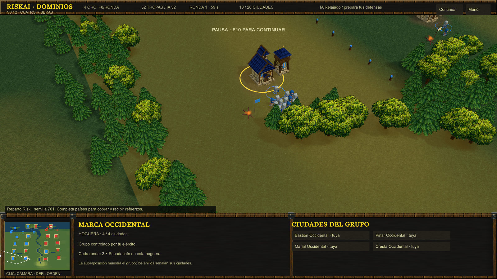
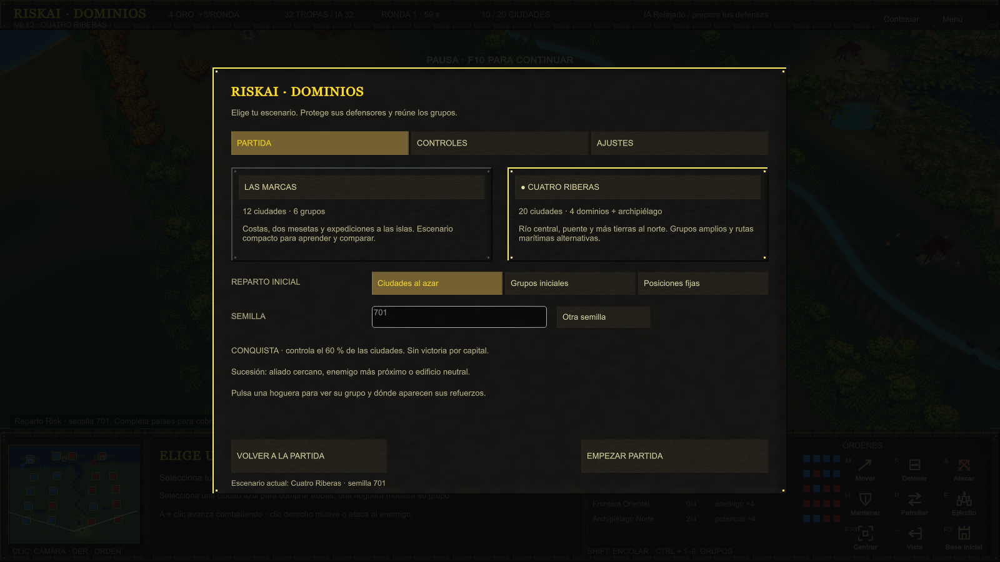
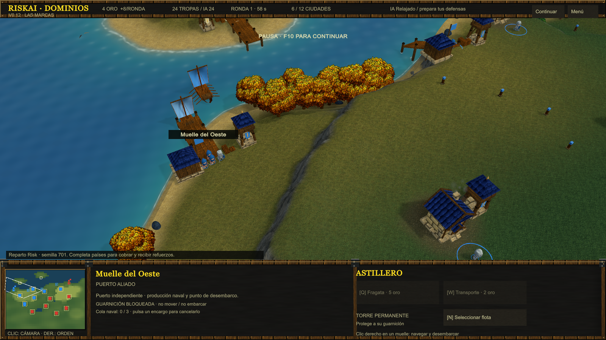

# Validación v0.12

Fecha: 2026-09-06. Unity 6000.3.23f1, URP, Windows x64/Mono. Esta validación corresponde a la partida local; no acredita touch, Web, Android ni multijugador.

## Pruebas de reglas y partida

| Suite | Resultado | Informe local ignorado |
| --- | --- | --- |
| EditMode | 32 aprobadas, 0 fallidas, 0 omitidas | `TestResults/editmode-v12.xml` |
| PlayMode | 65 aprobadas, 0 fallidas, 0 omitidas | `TestResults/playmode-v12.xml` |

EditMode terminó a las 01:07:42 UTC y PlayMode a las 01:22:19 UTC. Se comprueban sucesión y filtros de guarnición, economía por grupo completo, recompensas fraccionarias, dados/armadura/altura, reparto sembrado, reloj y clasificación de clic frente a arrastre.

La integración incluye captura conservando al sucesor, torres permanentes y su fuego, reacción defensiva de IA, equilibrio de población inicial, compras, refuerzos, proyectiles independientes de vistas, pausa, pools, curación, órdenes, navegación terrestre y naval. Las pruebas de escenarios usan el NavMesh real: ciudades y hogueras accesibles, rutas de los grupos continentales, islas, cruces de río y canal cerrado a infantería.

Después de estas suites se corrigieron detalles de presentación: liberar la textura del minimapa, textos y ayuda de grupos del HUD, encuadre de captura y absorción del agua. La ayuda de los grupos nuevos conservaba una consulta a los tres grupos antiguos; se eliminó y ahora muestra el límite por ciudades y puntos vivos. Las reglas de simulación no cambiaron después de las suites.

## Compilación e inspección visual

Ejecutable: `Builds/Windows-v0.12/RiskAI.exe`. Log local: `RiskAI/Logs/build-v12-release.log`, resultado `RISKAI_BUILD_OK: 195788886 bytes`. Capturas a 1600 × 900, semilla 701, mediante el ejecutable Windows real y su HUD.

Las capturas recorren ciudades, mesetas, puertos, flota, río, estuario, islas, hogueras, cámara alejada y menú. La población inicial observada es 24/24 en Las Marcas y 32/32 en Cuatro Riberas. La inspección visual tiene la simulación pausada y la IA desactivada; el comportamiento de combate se comprueba por separado en PlayMode.

Las dos ejecuciones finales completaron 13 PNG cada una y registraron `RISKAI_PLAYER_CAPTURE_OK`, sin excepciones, errores de shader ni aserciones fallidas en `player-v12-release.log` y `player-v12-classic.log` (carpeta local `RiskAI/Logs/`).

Ejemplos sin retoque del ejecutable:

## Límites observados

- La desembocadura conserva una diferencia visible de tono entre río y mar. El lecho continuo elimina los huecos anteriores, pero falta pulir la transición del material y de las orillas.
- El overlay deja ver el terreno; su límite exterior aún coincide con el borde del mapa. Acantilados, puentes, árboles y biomas admiten más trabajo visual.
- No se aprecia la banda horizontal brusca de sombra en las capturas de zoom y desplazamiento revisadas. No hay una medición de rendimiento ni una validación en otras GPU.
- Las capturas no sustituyen una partida de usuario: siguen pendientes la valoración de dificultad, tiempos de captura percibidos y control con ratón/trackpad real.
- Los perfiles propios y los campos todavía heredados de Warcraft están identificados en la [auditoría](RISK-RULES-v0.12.md). No se han reconstruido las tablas completas de TFT 1.21b ni abierto World Editor.

Los siguientes pasos están en [TODO.md](../TODO.md).

## Ajuste de claros y barras

Tras el feedback sobre edificios tapados por árboles y barras vacías, se repitieron las ocho pruebas existentes de `MapVariantTests` y `NavalGameplayTests`: 8 aprobadas, 0 fallidas, 0 omitidas (`TestResults/playmode-v12-clearings.xml`, fin 02:54:47 UTC). Comprueban que el nuevo arbolado conserva rutas, círculos accesibles, refuerzos, cruce del río, desembarco y captura insular; las posiciones de puertos siguen siendo las mismas.

Compilación `RISKAI_BUILD_OK: 195789910 bytes` en `build-v12-clearings.log`. Ambas ejecuciones de captura finalizaron con 13 PNG y `RISKAI_PLAYER_CAPTURE_OK`, sin excepciones ni errores de shader (`player-v12-clearings-expanded.log` y `player-v12-clearings-classic.log`). Se revisaron puertos y ciudades insulares antes ocultos; la captura del puerto seleccionado confirma la ausencia de una barra vacía.

