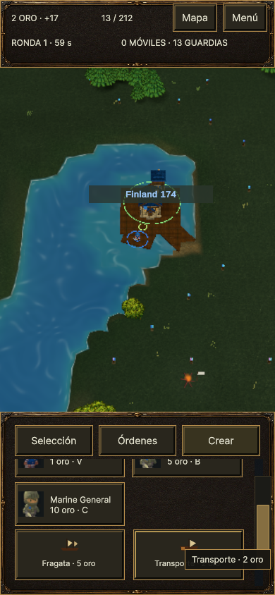

# Validación v0.21 · controles, puertos y expediciones

## Resultado y alcance

La ronda corrige cámara en pausa, selección propia y rueda dentro del HUD;
unifica la guarnición terrestre/naval del puerto; incorpora expediciones
marítimas de la IA por las órdenes normales del jugador. Los cuatro escenarios
consumen las mismas reglas. La clasificación de orilla usa los datos del mapa,
sin introducir excepciones de IA ni cambios de escala.

## Cambios comprobados en Unity

- El arrastre derecho se cancela una vez al cambiar pausa, en lugar de cada
  fotograma pausado. Ratón, touch y lápiz permiten inspección/cámara en pausa;
  las órdenes de simulación siguen bloqueadas. Modales y pérdida de foco
  cancelan gestos pendientes. Las coordenadas del ratón ya no dependen del
  último `Pointer` actualizado por otro dispositivo.
- La caja de edificios incluye sólo puestos propios; Shift sobre terreno
  vacío conserva selección. El clic directo sigue permitiendo inspección.
- `CityClaimZone` contiene un único guardián de tierra o mar. Propiedad,
  torre y producción leen ese estado. Relevo voluntario común a 2,0 unidades
  frente al círculo pintado de 1,55; prioridad aliada, distancia e identidad.
- La fragata puede ocupar un puerto vacante; un transporte no. Un guardián
  vivo no es sustituido por cercanía. Las anclas físicas terrestre y marítima
  continúan siendo distintas: no se presenta como reproducción exacta del
  círculo único de WC3.
- Embarque y descarga comparten `ShoreAccess`: playa fuente `Vcbp` en los
  importados, o una pasarela de puerto transitable. El atraque para carga se
  busca a distancia de embarque de la pasarela; no depende de que el ancla
  militar del puerto esté lo bastante cerca.
- La IA filtra caminos terrestres completos con presupuesto acotado; mantiene
  su cursor de búsqueda ante objetivos inaccesibles. Su comandante naval
  compra transportes, reserva 2–4 tropas móviles, reúne, carga, navega,
  descarga y da ataque en formación. Respeta la gracia naval y el ahorro de
  la primera fragata. Recupera transportes con carga tras una misión fallida.
- ScrollView usa rueda nativa; el zoom de cámara no cambia sobre el panel.
  Fragata/transporte tienen iconos en botones. La explicación de las colas
  pasa a ayuda al pasar ratón/lápiz, con overlay de runtime, sin ocupar
  permanentemente el HUD. El indicador de rendimiento espera una muestra
  en vez de mostrar ceros iniciales.

## Pruebas automatizadas

Unity **6000.3.23f1**, Windows: **97 casos PlayMode distintos aprobados**
según el resultado más reciente de cada caso, más **3/3 EditMode** de
argumentos de lanzamiento. No se suman repeticiones como casos nuevos.

| Informe local | Resultado de esa ejecución |
| --- | --- |
| `RiskAI/Logs/v21-input-final.xml` | 30/30 |
| `RiskAI/Logs/v21-camera-final.xml` | 18/18 |
| `RiskAI/Logs/v21-integration-final.xml` | 29/36; fallos revisados debajo |
| `RiskAI/Logs/v21-integration-r2.xml` | 17/21; repeticiones dirigidas |
| `RiskAI/Logs/v21-integration-r3.xml` | 15/16; último mensaje de error corregido |
| `RiskAI/Logs/v21-ui-r2.xml` | 10/10; todos los fallos anteriores cubiertos |
| `RiskAI/Logs/v21-launch-arguments.xml` | 3/3 EditMode |
| `RiskAI/Logs/v21-release-fixes.xml` | 16/16; catálogo importado, colas y expedición |
| `RiskAI/Logs/v21-review-fixes.xml` | 19/20; una expectativa de fixture revisada |
| `RiskAI/Logs/v21-review-fixes-r2.xml` | 1/1; expedición con comandante naval aislado |
| `RiskAI/Logs/v21-review2-fixes.xml` | 15/16; reserva comprobada demasiado tarde en el fixture |
| `RiskAI/Logs/v21-review2-fixes-r2.xml` | 2/2; cursor ante cambios de tropa y propietario |
| `RiskAI/Logs/v21-review3-fixes.xml` | 9/9; frontera de ciudades, barco compatible, error antiguo y expedición completa |
| `RiskAI/Logs/v21-movement-stages-r2.xml` | 4/6; dos problemas de fixture corregidos |
| `RiskAI/Logs/v21-movement-stages-r3.xml` | 6/6; etapas de movimiento, pausa y cancelación |

Cobertura: cámara/pausa, ratón, lápiz y touch, selección, guarnición de
puertos en cuatro mapas, playa/descarga en Europe y New World, navegación
terrestre, expedición completa, menú, HUD, scroll y tooltip. La expedición
usa cola pagada y fotogramas reales, con una fragata ocupando el atraque de
origen. Verifica identidad de tropas embarcadas/desembarcadas y camino
completo hasta el objetivo enemigo; no concede propietario para simular éxito.

Las primeras invocaciones detectaron errores de compilación en fixtures,
referencias tras cambiar la API de costa y una ambigüedad de `PointerType`.
Se corrigieron antes de las ejecuciones aprobadas. Las repeticiones también
corrigieron selección de islas del fixture, posiciones de relevo todavía
ocupadas, ahorro de la primera fragata y mensaje de fallo naval. Los eventos
sintéticos de rueda necesitaban el modo de foco del editor apropiado; el
cambio de foco está limitado al fixture y se restaura al terminar.

Ratón/touch/lápiz sintéticos recorren Input System y UI Toolkit. Esto no
certifica periféricos físicos ni tablet Android/ARM.

La ronda posterior a revisión cubre relevo de galera con navegación real,
presión enemiga junto a un guardián naval vivo, continuación del objetivo
terrestre tras reemplazar una tropa, siete puertos desconectados antes de un
fallback y selección de fuente según el componente marítimo del transporte.
Los dos últimos fixtures usan geometría marítima sintética y adaptadores de
puerto con puntos de carga precalculados; no prueban una travesía completa
de recuperación. La expedición completa se prueba por separado.

El primer pase completó el viaje con tropas reclutadas por el comandante
terrestre durante la espera, pero el fixture exigía sus dos soldados iniciales.
La repetición ejecuta sólo el comandante naval, con reloj y movimiento reales,
y verifica esas identidades. Se conservó la comprobación de que fabricar
el transporte no reserva a los soldados. No se cuentan como dos casos el
test de cursor anterior y su extensión para cambios de roster. Total anterior: 86 casos. La segunda corrección de revisión suma cinco: 91 casos.

La segunda corrección comprueba fuentes alternativas, pares ciudad/puerto
que conservan una ruta válida, salida de una ola parcial basada sólo en carga,
guardia terrestre frente a un barco enemigo y fin del embarque sin progreso
con aviso al jugador. El embarque comprueba la costa a 5 Hz; sus reintentos
no relajan la regla de playa. El primer pase comprobaba la reserva después
de permitir un frame de combate autónomo; el segundo comprueba su ausencia
de orden inmediatamente después de emitir la formación.

La tercera corrección pasó nueve casos en `v21-review3-fixes.xml` (34,15 s):
los seis casos existentes de planificación/expedición y tres regresiones
nuevas. Comprueban que el octavo candidato no queda oculto tras siete ciudades
de otra isla, que un barco aislado permite fabricar y seleccionar uno local
pagado, y que un error antiguo de embarque no inutiliza al transporte.
La primera usa tres componentes NavMesh construidos en el fixture; la segunda
conserva la cola real y adapta los puntos del puerto a dos mares sintéticos.
La travesía completa sigue cubierta por un caso separado con movimiento real.
Total consolidado: 94 casos Unity distintos (91 PlayMode y 3 EditMode).

## Exportaciones, inspección y rendimiento

El ejecutable Windows del commit `49a2e28` se generó correctamente:
206.879.656 bytes según `v21-windows-r4.log`. El smoke nativo creó Europe
con 16 jugadores y verificó diagnósticos de colas (cinco navales y una de
Marines), pero **no produjo capturas desde la ventana oculta**: el log
`v21-r4-europe-capture.log` contiene `Failed to capture screen shot` y el
directorio está vacío. No se cuenta como aceptación visual del nuevo
binario, ni se presenta su comparación de frames como rendimiento final.
No apareció un diálogo de permisos ni se ha establecido una interacción
exclusiva del usuario necesaria para continuar.

Las imágenes nativas anteriores de `Captures/v21-final-europe` y
`Captures/v21-final-ui-phone` pertenecen a `060ed60`, a 1600×900 y 390×844.
Se inspeccionaron catálogo portuario, colas e interfaz compacta; no son
capturas de un teléfono físico. Los cambios posteriores son de planificación,
embarque, errores y un límite naval compartido; no cambiaron arte ni layouts.
Se conserva la procedencia anterior sin atribuir las imágenes al binario
nuevo. La aceptación Web posterior se detalla a continuación.

La exportación Web `49a2e28` se comprobó en Edge 152.0.4191.66 mediante
entrada CDP al jugador Unity real: el lápiz inició Europe con 16 bandos,
rueda cambió zoom en pausa, arrastre derecho movió cámara y el central
invirtió ese desplazamiento; dos dedos cambiaron encuadre/zoom. El contador
de ronda permaneció en 59 s. La rueda del ranking mostró filas inferiores y
volvió al principio, manteniendo el mapa detrás. F3 seleccionó un puerto
propio; W descontó dos de oro y agregó un transporte a la cola. A 390×844
se inspeccionaron las pestañas y el catálogo de Marines. Evidencia:
`Captures/v21-web-final-ui`; el helper local es una extensión de
`scripts/check_web_ui.py` que añade el argumento Europe y eventos normales
de teclado/ratón, sin modificar estado interno de Unity.

Esa inspección detectó **agua invisible** pese al smoke `success=true`:
el perfil Mobile elegido para WebGL/Android no proporcionaba las texturas
de profundidad/color que consume el shader. `a4060df` habilita ambas sin
cambiar la regla de costa ni duplicar el agua. Su exportación Web terminó
con 57.414.383 bytes (`v21-web-water.log`). La repetición visual en
`Captures/v21-web-water` muestra el lago y la orilla alrededor de Finland 174,
compra pagada y adaptación compacta. La silueta escalonada sigue pendiente.
La consola no registró excepciones JavaScript; sí conserva tres diagnósticos
de shaders auxiliares no soportados (CoreCopy, StencilDitherMaskSeed y
HDRDebugView). El éxito del helper no certifica todos los shaders ni sustituye
la inspección visual. No se hizo una medición física de tablet o stylus.

La exportación Windows de `a4060df` terminó con 206.879.462 bytes
(`v21-windows-water.log`). La repetición con ventana visible generó las
16 imágenes de `Captures/v21-native-visible` y salió normalmente. Se
inspeccionaron puerto, iconos, colas y agua; el fallo de captura oculto del
commit anterior permanece registrado y no cuenta como aceptación visual.
Las imágenes son de una escena preparada por la sonda: no prueban por sí
solas el funcionamiento de una expedición de IA durante una partida libre.

En Web, `Captures/v21-web-port-scroll` muestra además la rueda dentro del
catálogo de producción a 390×844: desplaza el panel hasta fragata/transporte
sin mover el mapa. El tooltip aparece al pasar por transporte. Son eventos
CDP dentro del reproductor exportado, no una prueba de dispositivo físico.

La primera exportación Windows terminó correctamente (206.875.846 bytes).
Las capturas Europe de `Captures/v21-europe` detectaron que el HUD trataba
el alias terrestre del puerto como ciudad: mostraba el catálogo regular
antes del naval y ocultaba su segunda cola. Se corrige antes de dar por
válidas las exportaciones finales. La compilación Web intermedia se detuvo deliberadamente durante wasm-opt
al detectar ese defecto, antes de publicar. No se cuenta como exportación
Web validada. La corrección del catálogo y un filtro temprano de viabilidad
naval se aplicaron después de las sondas de rendimiento: las cifras siguientes
describen la primera build, no una medición del último parche.

La prueba de navegación usa Europe, 16 bandos, semilla 160212, 900 segundos
simulados de calentamiento, 24 reclutas por bando y 90 segundos medidos a 1x.
CPU Ultra 9 285H, RTX 5080 Laptop, 1600×900. No hubo compilación Unity en
paralelo. Sí se observó `rustc` de otro proyecto durante la pasada 500; no se
observó en la pasada 1000. No se detuvo ningún proceso ajeno.

| Presupuesto NavMesh | Unidades inicio→fin | Frame medio / máximo | Frames >50 / >100 ms | Órdenes aplicadas / rechazadas / pendientes |
| --- | --- | --- | --- | --- |
| 500 | 604→310 | 9,76 / 186,77 ms | 14 / 1 | 892 / 0 / 0 |
| 1000 | 614→334 | 9,38 / 72,31 ms | 15 / 0 | 1054 / 0 / 0 |

Las seis identidades seguidas se movieron en ambas pasadas. Quedaron tres
supervivientes móviles y ninguno inmóvil. En ventanas enteras a 1x, el
primer movimiento humano promedió 60,25–61,31 ms (500) y 59,63–73,35 ms
(1000). Los máximos de esas ventanas fueron 94,07 y 252,44 ms respectivamente.
Las muestras de rutas pendientes dieron cero; son instantáneas, no una prueba
de ausencia de esperas entre muestras. En 500, el pico de frame coincidió
con 174,72 ms en IA naval; sin traza detallada no se atribuye todo ese coste
a una función concreta.

No se sube el presupuesto por defecto: los combates y la carga externa
difieren, el primer movimiento no mejora de forma clara y el número de
unidades cae durante la medición. Esto no reproduce 800 unidades sostenidas
ni mide latencia desde un clic físico. Informes locales:
`RiskAI/Logs/v21-path-budget-500.log`, `v21-path-budget-1000.log`;
resumen en `Captures/v21-perf/summary.json`.

Una pasada posterior del commit `060ed60`, con 48 reclutas por bando y
900 segundos de calentamiento, midió 957→443 unidades en 90 segundos: las
6 identidades seguidas se movieron, 1305 órdenes aplicadas, ninguna rechazada
y ninguna pendiente. Registró 22,29 ms de frame medio y 99,95 ms máximo.
**Es una medición con contención, no aceptación final de rendimiento**: el
supervisor informó a las 04:18 de unos 0,7 GiB libres mientras compilaba PWA;
se observaron procesos Rust ajenos durante esta pasada y no se tocaron.
Se repetirá sólo la aceptación temporal afectada cuando haya memoria estable,
sin compilación Unity en paralelo. Tampoco son 800 unidades sostenidas: el
ejército cayó durante el combate. Log: `v21-final-perf-48.log`; contexto en
`Captures/v21-final-perf-environment.json`. El siguiente parche de revisión
aún no está incluido en ese ejecutable.

La repetición visible de `a4060df` (`v21-final-perf-recovered.log`) completó
900 s simulados y 90 s medidos: 1008→511 unidades, 1325 órdenes aplicadas,
0 rechazadas/pendientes y 6/6 identidades con movimiento. Frame medio
20,00 ms, máximo 72,14 ms, 29 frames >50 ms y ninguno >100 ms.
**Sigue marcada con contención**: empezó con 5,74 GiB libres, pero la RAM
bajó hasta 1,04 GiB y volvió a recuperarse; hubo compilación ajena durante la
pasada. No se cerraron procesos compartidos. Contexto completo en
`Captures/v21-final-perf-recovered-environment.jsonl`.

La ventana que terminó con 834 unidades registra envío→aplicación humano
28,69 ms de media/57,35 ms máximo y primer movimiento 227,09/1086,11 ms.
Con 651 unidades, este último fue 135,63/569,90 ms. Las órdenes no se
acumulan en la cola, pero todavía hay demoras hasta moverse. Un muestreo
`pathPending=0` cada 30 s no descarta esperas transitorias entre muestras;
la métrica actual tampoco separa cálculo de ruta y evitación local. No se
presenta como corrección completa del retraso ni como 800 unidades sostenidas.
La aceptación temporal sin contención sigue pendiente, sin repetir suites
funcionales que ya pasaron.

Otra repetición de esa misma build, `v21-perf-quiet.log`, comenzó con
8,50 GiB libres y sin compilador observado. Durante la pasada reaparecieron
compiladores ajenos; el mínimo fue 4,96 GiB. La RAM se mantuvo recuperada,
pero la carga externa impide llamarla una línea base aislada. Midió
972→383 unidades, 1258 órdenes aplicadas, ninguna rechazada/pendiente,
6/6 identidades con movimiento, 21,88 ms medios y 99,90 ms máximo.
No se vuelve a repetir a ciegas la misma sonda mientras siga ese solapamiento.

La revisión del contador aclaró que «primer movimiento» exige velocidad
hacia el destino final, no cualquier inicio de movimiento. Un rodeo ya
iniciado puede prolongarlo. La instrumentación posterior `15e5be3` separa
ruta no pendiente observada, velocidad horizontal y velocidad dirigida,
con intervalos emparejados por orden. No se infiere un coste de evitación
restando promedios de muestras diferentes. Los seis casos dirigidos pasaron en 25,15 s con el fixture corregido
`624743c`; el código de juego no cambió entre esas repeticiones. La primera
compilación falló por acceso interno desde el ensamblado de tests. Después
se corrigieron dos supuestos del fixture: un tick automático adicional y
la velocidad solicitada a NavMesh, que se aplica en su siguiente actualización.
La prueba de velocidad opuesta usa muestras controladas y no se presenta
como una escena de evitación natural. Las nuevas exportaciones se cierran
por separado.

La observación pasiva anterior de v0.20 encontró órdenes aplicadas en
27–36 ms, pero una muestra de primer movimiento de 1,24 s y rutas pendientes
hasta 800 ms. Los picos de 23–26 s coincidían con cambios de foco y no quedan
explicados por los tiempos de tick registrados. Las mediciones anteriores
no se atribuyen al parche nuevo.

Las exportaciones con la instrumentación `624743c` terminaron: Windows
206.882.216 bytes (`v21-windows-stages.log`) y Web 57.415.347 bytes
(`v21-web-stages.log`). La presentación no cambió frente a las capturas
`a4060df`; la nueva aceptación del jugador verifica los contadores añadidos.
El editor Windows había quedado abierto por omitir `-quit` en el lanzador
de esa comprobación; se cerraron sólo ese proceso propio y sus importadores
verificados después de `RISKAI_BUILD_OK`. Web incluyó `-quit` y salió con 0.

La sonda Windows `v21-perf-stages.log` comprobó esos contadores en la
partida avanzada: 937→468 unidades, 966 órdenes aplicadas, 0 rechazadas o
pendientes y 6/6 identidades que se movieron. Sólo una seguía viva al final;
13 intentos de destino no encontraron un punto válido y no enviaron orden.
La media de frame fue 20,74 ms y el máximo 97,14 ms. Se conserva como
**diagnóstico con contención**: RAM inicial 7,85 GiB, mínimo 2,53 GiB,
compilación ajena observada. No demuestra 800 unidades sostenidas.

| Ventana a 1×: unidades al final | Aplicación→ruta observada, media/máximo | Ruta→velocidad, media/máximo | Velocidad→condición dirigida, media/máximo |
| --- | --- | --- | --- |
| 748 | 85,87 / 392,37 ms | 39,32 / 91,39 ms | 3,58 / 174,44 ms |
| 583 | 59,85 / 309,26 ms | 23,88 / 104,79 ms | 0 / 0 ms |

Los intervalos se emparejan por orden; los conteos pueden diferir por
cancelación o cambio de ventana. La primera fila contiene 60 observaciones
de ruta y 59 de velocidad. No se suman máximos ni se atribuye toda la espera
a evitación. Las muestras muestran por qué hace falta comparar navegación
con posiciones/carga controladas antes de cambiar el presupuesto compartido.
Evidencia: `Captures/v21-perf-stages-summary.json` y su registro de entorno.

El smoke Web final `Captures/v21-web-stages` también pasó: Europe, semilla
19031, 16 bandos, 60 s, 293→328 unidades, 127 órdenes aplicadas, ninguna
rechazada/pendiente y 6/6 identidades con movimiento. Cinco destinos de la
sonda no eran transitables; sólo dos unidades seguidas sobrevivieron. Los
campos de etapas llegaron a la consola IL2CPP y la captura final se
inspeccionó. No hubo excepciones JavaScript; quedan el 404 del favicon y los
tres diagnósticos de shaders auxiliares ya descritos. La sonda reportó
28,21 ms medios/57 ms máximo, sin que esta ejecución corta en Edge/NVIDIA
certifique una tablet, ARM o una partida de 800 unidades. No se ejecutó en
paralelo con un jugador nativo ni con una compilación Unity propia.

El lector pasivo pasó 7/7 casos (`scripts/test_observe_runtime.py`) y su ruta
por defecto vuelve a coincidir con el lanzador v0.21. La comprobación del
servidor local de gzip/MIME pasó con
`python scripts/test_serve_web.py` (1/1). La invocación inicial por nombre de
módulo desde la raíz falló por importación; ejecutar el script desde su ruta
resolvió el lanzador sin modificar el test.

## Límites restantes

La separación visual arena/roca/verde no suaviza la geometría escalonada de
la costa. El shader interpola materiales; en el borde de una playa importada
manda el tile fuente para decidir si se puede embarcar. Las expediciones
buscan puertos con acceso al objetivo, no cualquier cabeza de playa posible.
No hay medición en hardware ARM, servidor autoritativo ni multijugador.

[Reglas navales y procedencia](audits/NAVAL-v0.21.md) ·
[Revisión Grok](audits/GROK-v0.21.md) · [Observabilidad](OBSERVABILITY.md) ·
[Pendientes](../TODO.md) · [Fase 2](PHASE2.md).
