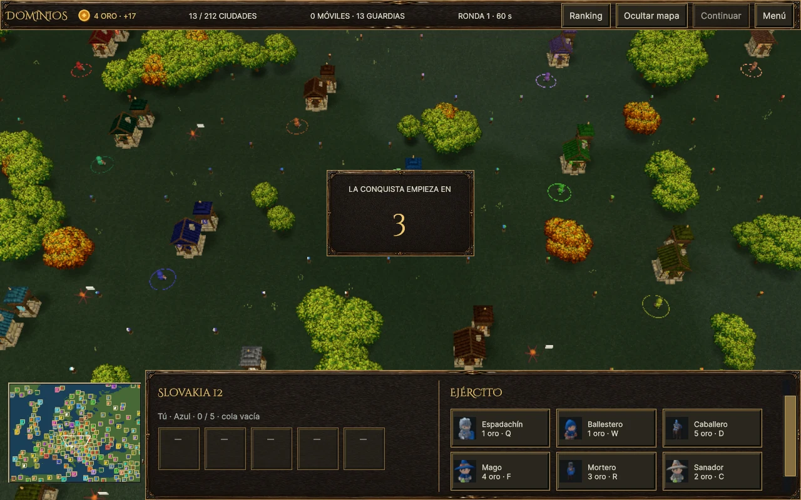
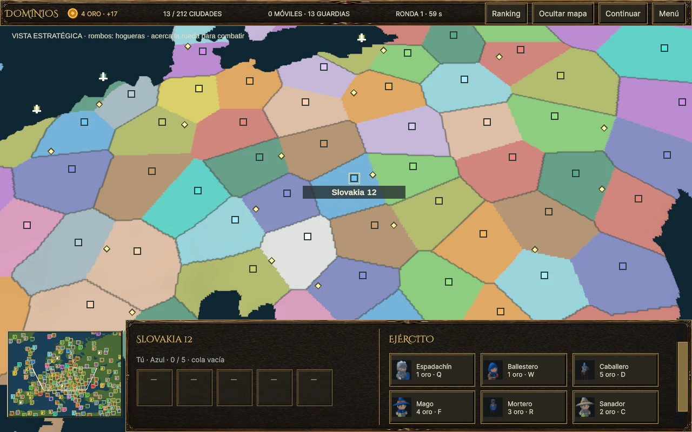
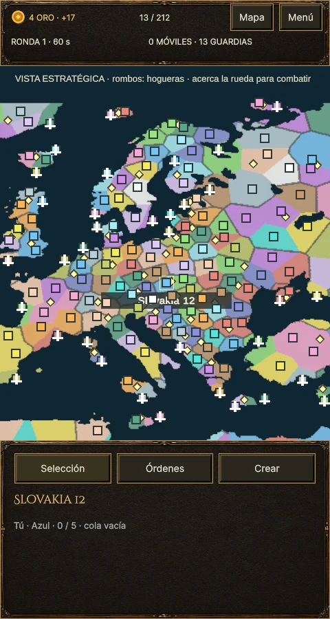

# v0.22: mapa estratégico, arranque y autonomía

Runtime `ff33720`, acabado visual `7448c3a` y compatibilidad de automatización
`9fb6beb`. El modo de colores entra al alejar la cámara hasta tamaño
84 (antes 72) y sale por debajo de 73,92. Mantiene la histéresis para evitar
parpadeos al invertir la rueda. El zoom interpola el logaritmo de su escala,
sin el antiguo límite fijo de 200 unidades/s: la misma proporción de zoom
tarda lo mismo en vista táctica y estratégica. Conserva ancla bajo el cursor,
encuadre del mapa y controles de rueda/pinza.

## Países e interfaz

El borde del mapa estratégico compara el identificador de país/hoguera del
atlas, no el propietario ni el identificador de ciudad. Las ciudades de una
misma hoguera permanecen dentro de un contorno común aunque pertenezcan a
jugadores diferentes. El color sigue mostrando el dueño de cada ciudad,
permitiendo localizar las que faltan para completar el grupo.

El trazo oscuro tiene suavizado mediante derivadas de pantalla. Cuatro
lecturas vecinas del atlas existente añaden un coste de fragmento constante;
no hay geometría, texturas nuevas ni reconstrucción de fronteras por frame.
El agua y los terrenos sin grupo no reciben ese borde. La inspección táctica
de una hoguera conserva su presentación anterior.

El encabezado muestra una moneda vectorial junto al oro en escritorio y
pantalla compacta. Usa el sistema de ornamentos existente y no depende de
una fuente de emojis ni de imágenes nuevas.

Las partidas iniciadas desde el menú, incluido el acceso Web directo con
`riskai-play`, muestran una cuenta atrás de tres segundos. Durante ella no
avanzan reloj, economía, IA, combate ni navegación de soldados, y las órdenes
de juego quedan bloqueadas. Pausa no permite saltarla. Se mide con tiempo
real desde el final de la construcción de la escena, sin incorporar ese
tiempo previo al reloj de simulación. Las sondas y capturas automatizadas
pueden omitirla; los fixtures de sesión aislada no la activan por defecto.

## Autonomía

La [revisión de comportamiento base](audits/UNIT-AUTONOMY-v0.22.md) separa
defectos, adaptaciones locales y reglas de WC3 todavía pendientes de
contrastar. Se corrigieron tres defectos:

- Seguir conserva el identificador de la unidad. Al morir o salir de la
  sesión se completa la orden; reutilizar su objeto no cambia a quién sigue.
- Un barco conserva el destino original de avanzar atacando y reconstruye
  la ruta marítima cuando termina el combate.
- Recibir daño no sustituye el objetivo explícito de ataque de un barco.

La revisión también documenta persecución y regreso navales, prioridades,
asistencia entre aliados, adquisición, mantener posición y ataques a blancos
inaccesibles. No se presentan todas esas políticas como paridad ya resuelta.

## Pruebas

**77 casos Unity distintos con último resultado aprobado:** ocho EditMode
de respuesta proporcional, inversión/tiempo cero y encuadre de los cuatro
mapas; 69 PlayMode de cámara, HUD, arranque, fronteras, comandos, combate y
embarque naval. La pasada PlayMode inicial aprobó 68 casos y falló el fixture
gráfico de fronteras porque no dibujaba su terreno con matrices inmediatas.
Se corrigió para usar una solicitud de render de la misma pipeline del
juego, y pasó su repetición. No se cambió el shader para satisfacer el test.
La inspección del navegador motivó después un borde algo más marcado y
ocultar etiquetas del mundo durante la cuenta atrás para evitar que cubran
su título. Se repitieron las pruebas de fronteras y cuenta atrás: dos aprobadas.

La prueba de fronteras comprueba grupos distintos con el mismo propietario,
ciudades de propietarios distintos en el mismo grupo y ausencia de borde
junto al agua. Las pruebas de autonomía ejercitan muerte y reutilización de
unidades, interrupción de ruta por combate y órdenes explícitas de ataque.

## Comprobación visual en Web

Edge renderizó Europe con 16 jugadores en 1280 × 800 y 480 × 900. Ambas
pasadas comprobaron la cuenta atrás, encabezado de oro, encuadre del mapa
completo y transición por rueda de la vista táctica a la estratégica, sin
errores de página. La entrada de rueda procede de Playwright; las acciones
de encuadre usan los métodos normales del componente exportado. No es una
prueba de dispositivo táctil físico ni un benchmark.

Las capturas son de `7448c3a`. El ajuste posterior `9fb6beb` amplía únicamente
el reconocimiento de argumentos de automatización para omitir la cuenta
atrás en las capturas UI/presentación y sondas de reinicio. Los nombres de
captura temprana/media/tardía indican el momento solicitado, no garantizan
qué número queda visible tras el coste de capturar el frame. Los JSON guardan
la hora real de cada captura respecto a la señal de mapa construido.

El log conserva los mensajes conocidos de shaders internos de URP no
compatibles y el recurso favicon ausente. No se presentan como corregidos.

Windows y Web se exportaron con `9fb6beb`. La captura automatizada de Windows
completó sus nueve imágenes y comprobaciones con `--riskai-presentation-capture`,
confirmando que sigue funcionando el acceso automático a la escena. Las
builds anteriores se conservan en `Builds/*-v0.22-before-strategy`.

La sonda funcional de la Web final completó 60 s reales (59,95 s simulados),
122 órdenes aplicadas, cero rechazadas/pendientes y movimiento en los seis
soldados observados. Europe pasó de 293 a 328 unidades, sin error de página.
El cargador tardó 4,607 s y la señal de mapa listo llegó a 14,943 s. Se
observaron 34,94 ms/frame de media y un máximo de 346 ms, con 127 frames
por encima de 100 ms. La funcionalidad pasó; estos datos **no** cierran la
fluidez Web. No se controló la carga externa ni se hizo una comparación
emparejada, por lo que no se atribuye la diferencia a esta revisión.

[Recibo de pruebas, capturas, sonda y hashes de exportaciones](audits/v0.22-strategy-start/receipt.json).

Los [valores actuales de Reforged](audits/REFORGED-LATEST-INHERITANCE.md) y el
[catálogo pendiente](audits/SOURCE-ROSTER-NEXT.md) se documentan por separado;
esta revisión no añade unidades nuevas ni declara cerradas las
mediciones de rendimiento con grandes ejércitos o dispositivos ARM físicos.
