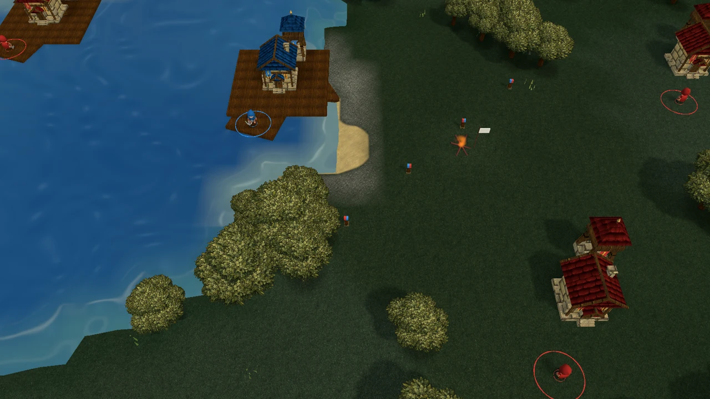
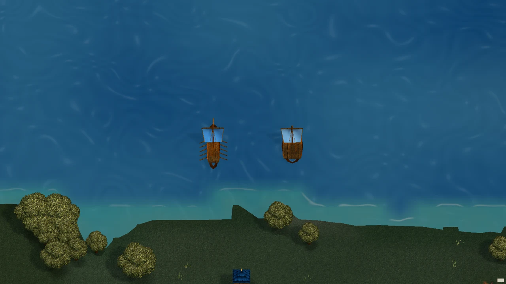

# v0.22: agua, atraque y reglas de combate

Esta revisión incorpora `e89fdfe` (agua, atraque e interfaz), `e603d81`
(matriz de daño completa) y `3b83279` (armas, entrenamiento y transporte).
Los cambios comprobados acercan el comportamiento al mapa fuente; **no
constituyen todavía una réplica computativa completa de Warcraft III**.

## Agua e interfaz

El color del mar importado depende del campo costero continuo, en lugar de
copiar los cambios de profundidad de los triángulos del fondo. La transmisión
del fondo desaparece a partir de 45 cm, conservando transparencia y contacto
en la orilla. El tinte base se oscurece aproximadamente un 12 %. No se añaden
geometría, pases ni muestras de textura al efecto.

Las capturas anteriores y posteriores usan la misma escena y cámara; las
ondas se animan y no representan el mismo instante. Una prueba GPU compara
fondos de distintos colores y profundidades oceánicas reales, y comprueba la
transparencia en contacto y sobre geometría situada por encima del agua.

La inspección de ambos barcos en movimiento muestra cubiertas opacas sin
ondas superpuestas. El casco inferior continúa sumergido. Esta captura usa
una preparación explícita de escena; no mide entrada física ni rendimiento.

Los edificios ajenos y neutrales dejan de mostrar botones y colas de
producción. El panel se reconstruye cuando cambia el propietario, aunque
continúe seleccionado el mismo edificio.

## Atraque y transporte

La orden de navegar a un puerto conserva su destino. Dentro del atraque de
7,5 m, un barco elegible puede completar el ajuste local a la guarnición si
existe un segmento marítimo directo y seguro. La elección común de sucesor
ocurre antes del ajuste: conserva defensores vivos, prioridad aliada,
desempates y relevo de 2 m. Una orden nueva aceptada, detenerse o morir
cancela la intención anterior. Se comprobaron llegada desde lejos, orden
local, cancelación e istmos en mapas clásicos e importados.

El transporte actual corresponde a `n008`. JASS excluye `n007/n008` de
capturar círculos; `n009`, del conjunto Classic, no aparece en esa exclusión.
No se trasladó esa excepción a `n008`. Su habilidad adjunta `Sch3` define
`Car1=10`: ahora tiene **10 plazas**, verificadas contra la modificación
binaria original de W3A.

## Datos originales y cambios aplicados

La [resolución completa](audits/reforged-source-resolution.md) cubre 69
objetos W3U, las dos armas, máscaras, W3A/W3Q y condiciones JASS. La unión
de objetos potencialmente disponibles contiene 40 identidades; el conjunto
predeterminado deja **17 reclutables**, no 40 simultáneos. Los JSON guardan
campos, desplazamientos binarios, tablas base y procedencia:

- [Tabla completa inicial](audits/reforged-complete-combat-table.md).
- [Resolución de campos y modos](../data/derived/reforged-source-combat.json).
- [Perfiles navales y excepciones](audits/naval-source-parity.md).

Se aplicaron estas correcciones al catálogo que ya representa el juego:

- Matriz completa de 7 ataques × 8 armaduras, incluida Divine, conservando
  los identificadores anteriores. Los 56 coeficientes se contrastan con el
  `war3mapMisc.txt` extraído. El coeficiente de armadura 0,06 está respaldado
  por el MiscData RoC local; la fórmula negativa conserva el adaptador previo.
- Ballestero y Marine Private resuelven el impacto de su arma instantánea
  al terminar la preparación. La categoría del daño ya no decide por sí sola
  si existe proyectil o daño de área.
- Medic usa proyectil a 22 m/s; mortero, a 18 m/s y punto de impacto fijado al
  disparar. Sus zonas de daño son 0,5/3/5 m, con factores 1/0,35/0,1. La
  galera usa 22 m/s y zonas 0,5/0,7/1 m con factores 1/0,3/0,1. Las cifras
  heredadas conservan las etiquetas de evidencia histórica del informe.
- Las máscaras de área distinguen clases, aliados, enemigos, neutrales y
  al propio atacante. El mortero puede dañar aliados permitidos por su
  máscara; la galera restringe su área a enemigos y neutrales. Un impacto
  dirigido no depende de que el blanco continúe en la misma celda espacial.
- La adquisición usa 12 m para ballestero/Marine Private, 10 m para
  caballería, 8 m para Medic y 18 m para mortero. Descubrimiento y retención
  respetan esas distancias; las guarniciones continúan ancladas.
- El poste conserva su arma de 13 m, daño 45+1d5 y ciclo de 0,9 s; ahora
  prepara el disparo durante 0,3 s y usa proyectil a 32 m/s y armadura
  Divine. La mejora `Rhri` del mapa significa `renw=1`, habilitar arma 1,
  y se investiga en el modo predeterminado. No es el bonus estándar de
  alcance de Long Rifles ni una razón para desactivar el poste.
- Las siete clases terrestres con identidad fuente y ambos barcos usan
  entrenamiento de **1 segundo**, como sus modificaciones `ubld` explícitas.
  Los tiempos de los dos prototipos locales, Footman y Mage, se conservan.

La copia de un parámetro explícito se distingue de su herencia. Las tablas
legibles extraídas de los discos RoC/TFT permiten comparar candidatos
históricos; no se mezclan silenciosamente cuando discrepan.

## Validación y límites

**81 casos Unity distintos aprobados en esta revisión.** La entrega conserva
los XML originales y un [recibo de pruebas, capturas y builds](audits/v0.22-water-combat/receipt.json).
Los generadores Python se compilaron y ejecutaron nuevamente: 69 objetos
W3U, 27.525 bytes interpretados y 17 unidades reclutables por defecto.

Las exportaciones Windows y Web se reconstruyeron con `3b83279`. La prueba
final en Edge, con Europe, 16 jugadores y lienzo de 1280 × 800, completó
60 segundos medidos: 129 órdenes aplicadas, cero rechazadas y movimiento
comprobado en los seis soldados observados. La partida pasó de 293 a 328
unidades, sin errores de página; el único error HTTP fue el favicon
ausente. El log de Unity conserva tres mensajes de shaders internos no
compatibles (`CoreCopy`, `StencilDitherMaskSeed`, `HDRDebugView`); la prueba
funcional pasó, pero esos mensajes no se consideran resueltos. El cargador
tardó 2,969 s y la señal de batalla lista llegó a
10,668 s. Se observaron 23,83 ms por frame de media y 43 ms de máximo bajo
carga externa variable. Es una comprobación funcional de esta exportación,
no una comparación limpia de rendimiento ni una validación con 900 unidades.

La primera pasada de combate se interrumpió antes de ejecutar casos por
errores de escritura de archivos temporales de Unity. Fijar el directorio
de trabajo al proyecto permitió repetirla. De 44 casos, uno falló porque
su preparación desactivaba al propio guardián y dejaba vacante la torre;
se corrigió esa preparación y pasaron los siete casos de su suite. Los
43 restantes ya habían pasado. Ambos intentos se conservan.

La escena de barcos inicial tenía un encuadre incorrecto y fue descartada.
La repetición comprueba que ambos barcos se mueven y permanecen dentro del
encuadre. Las capturas de agua preceden a los cambios de combate, que no
modificaron los shaders.

El mapa declara **Reforged 2.0.2.22796** y conjunto de datos `0`, que significa
predeterminado; no identifica por sí solo una tabla RoC o TFT. Falta una
instalación o medición del motor correspondiente para cerrar la herencia
exacta. Persisten diferencias entre tablas para defensa/cadencia de varias
unidades, datos sólo disponibles en TFT, curación del Medic, movimiento de
misiles y ciertas reglas del motor. Los valores conflictivos existentes no
se sustituyeron por otro candidato histórico.

El catálogo completo y los modos están auditados, pero el runtime conserva
su selección actual de unidades: faltan unidades originales, variantes y
efectos dinámicos de tecnologías/modos. También mantiene adaptaciones de
persecución, elevación y representación de edificios. El HP/armadura numérica
del poste permanente sigue usando su estructura local; capturarlo depende
de la guarnición, no de destruir el edificio. El daño de área a árboles no
está implementado como destrucción de vegetación.

Esta revisión no cierra las mediciones de rendimiento pendientes: comparación
limpia de presupuesto 2000, partida avanzada, mayor fluidez Web con 900
soldados y ARM físico. El presupuesto de navegación continúa en 500; el
[seguimiento anterior](VALIDATION-v0.22-FOLLOWUP.md) conserva sus mediciones y límites.
