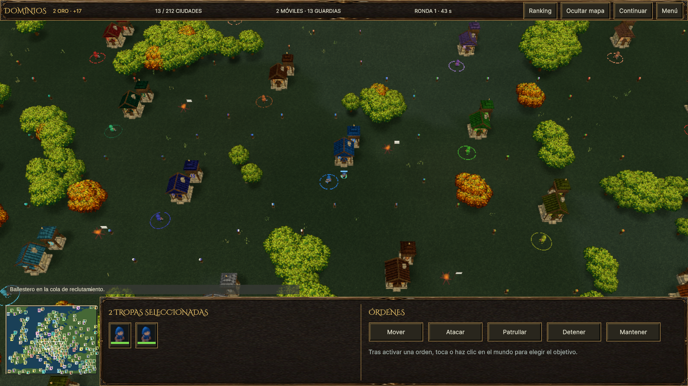
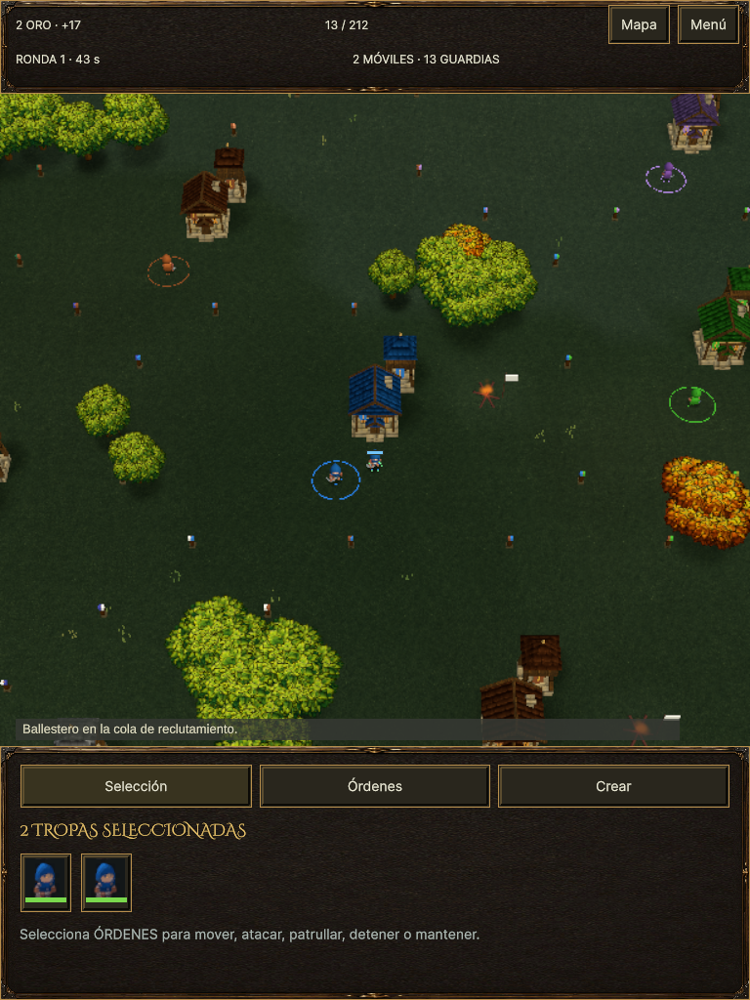

# Roster compartido · v0.21

La migración a UI Toolkit había conservado el contador de tropas pero había
retirado los retratos individuales y la vida que mostraba `ArmyDetails` en
la v0.18 (`cd3ff21`). La inspección del reproductor Web `624743c` confirmó el
panel vacío al seleccionar dos ballesteros. Este cambio recupera esa
información y la selección individual en el panel compartido.

## Implementación

`4546e8d` añade tarjetas de 52×60 unidades lógicas, retratos y barras de
vida. Reutiliza la caché de retratos y el dibujo de barcos. Un grupo mixto
muestra tropas y barcos; la columna de escritorio y la pestaña compacta
llaman al mismo constructor. El ScrollView conserva todas las tarjetas.
Pulsar una aísla ese actor mediante los métodos de selección existentes.

`7c37028` mueve la comprobación de pertenencia al momento de pulsar; el
refresco de salud a 10 Hz queda lineal. También limpia la inspección anterior
al ampliar una selección terrestre, igual que las otras entradas de selección,
y da un ancho explícito a la pista de vida.

`edbc79e` compara las identidades ordenadas y la separación tierra/mar de
forma exacta. Dos grupos distintos podían compartir el hash anterior: los
pares de identificadores `(n,n+33)` y `(n+1,n+2)` colisionan al multiplicar
por 31. El snapshot se actualiza al reconstruir el panel, sin asignaciones
nuevas en la comparación por frame. Las tarjetas verifican la identidad del
actor, vida, equipo y selección antes de actuar; una vista reutilizada no
puede activar una tarjeta de su vida anterior.

No se cambian combate, economía, mapas, navegación, órdenes ni autoridad.
La limpieza de inspección sí cambia el estado local visible de selección;
es necesaria para que una ficha de enemigo no tape el ejército seleccionado.

## Revisiones

Tres contextos independientes de `claude-vei`, modelo real `claude-opus-5`,
revisaron `4546e8d` y los deltas proporcionales `7c37028` y `edbc79e`.
Se les entregaron fuentes congeladas y dependencias; no informes de otros
revisores. Root leyó los nueve informes. Los resultados finales no dejan
hallazgos P0/P1/P2 abiertos para este cambio. Los metadatos de la primera
llamada incluyen Haiku 4.5 auxiliar, que no se cuenta como revisor adicional.
No se usó Grok.

Los informes señalaron la inspección obsoleta, búsquedas anidadas al refrescar,
layout de la barra, la debilidad del hash y la necesidad de probar el retorno
real al pool. Se corrigieron o reforzaron esos puntos. Las dudas sobre ids
separados entre barcos y soldados se cerraron verificando el asignador común.
La reflexión del fixture se comprobó ejecutando el test, no mediante la
predicción estática de que un setter privado fallaría.

La caché de retratos era ya estática en las colas. Unity incluye variables
estáticas en su análisis de recursos usados; el cambio no destruye ni descarga
esos retratos. [Documentación de Resources.UnloadUnusedAssets](https://docs.unity3d.com/6000.3/Documentation/ScriptReference/Resources.UnloadUnusedAssets.html).

Quedan límites P3: no se ha perfilado un roster de cientos de tarjetas; los
tests usan reflexión para preparar selección y la selección de un único barco
usa una tarjeta mientras que un soldado usa su retrato grande. Los títulos
«tropas»/«unidades» distinguen grupo terrestre y mixto. Los perfiles actuales
usan vidas máximas enteras. El constructor privado recibe sólo listas tipadas
de Soldier y Ship. No se amplía el parche por tipos hipotéticos.

La advertencia de tarjetas de muertos requiere contexto: `RtsController.Update`
purga entradas no seleccionables cada frame con foco, antes de procesar input.
El fixture deshabilita ese controlador para mantener deliberadamente la tarjeta
antigua hasta el retorno del pool. El caso de pérdida prolongada de foco y
reutilización antes de volver sigue siendo una limitación del controlador;
este cambio protege la tarjeta antigua, no convierte toda selección en handles.

Dos intentos iniciales del lanzador de revisión fallaron antes de llamar al
modelo (`-p` se interpretó como parámetro del wrapper; el pipe no llegó al CLI).
Se conservaron los errores y se usó `--print` con lectura del paquete. No fueron
revisiones aprobadas ni fallos de cuota. Evidencia local en
`.tools/v21-review-roster/opus-*-final.json` y los paquetes de fuente asociados.

## Validación

La primera ejecución pasó 11 casos; el ajuste de inspección pasó 17 casos de
HUD, producción, rueda y entrada directa. Después, seis casos comprobaron el
ancho resuelto de la barra. La ejecución final pasó siete casos en 22,44 s:
los dos anteriores del HUD y cinco de roster, incluido un grupo de 34 actores,
la colisión real de ids, grupo mixto, salud y selección individual, inspección
anterior y muerte→retorno diferido→reutilización real del mismo objeto.

Hay 105 casos Unity distintos aprobados en la evidencia acumulada de v0.21.
Esto no significa que se hayan repetido 105 casos en el último commit: el
índice `Captures/v21-roster-release-tests.json` conserva el informe ejecutado
de cada caso. El último XML es `RiskAI/Logs/v21-roster-tests-r4.xml`.

Las builds originales `624743c` quedaron copiadas en
`Builds/Archive-v0.21-624743c`; se verificaron los 194 archivos por tamaño y
SHA256 antes de exportar de nuevo. El manifiesto está en
`Captures/v21-624743c-archive.json`. Su medición de rendimiento permanece
atribuida a esa fuente y no certifica el coste del roster nuevo.

Windows exportado desde `edbc79e` terminó correctamente: 206.885.094 bytes
según el informe Unity. La captura visible terminó con `RISKAI_UI_CAPTURE_OK`
y siete PNG; se inspeccionaron el retrato individual y las colas navales con
iconos y catálogo Marine. Ese fixture no selecciona varias unidades y no se
usa como prueba visual del roster múltiple.

La primera exportación Web de la misma fuente mostró dos tarjetas con vida,
selección individual al tocarlas en escritorio y vertical, y ambos retratos
en horizontal 1024×768 y vertical 768×1024. La selección por área con un
contacto y con punta de lápiz conservó dos unidades; doble toque y toque de
dos contactos las movieron a destinos distintos. El botón secundario del
lápiz inició movimiento de ambas y una llegó al destino; la otra murió por
combate después de recibir la orden. No se inyectó estado de Unity: se
reclutaron dos ballesteros pagando a través de los atajos normales.

Esta comprobación funcional no equivale a renderizado limpio: la consola
registró 250 avisos `GL_INVALID_OPERATION` por incompatibilidad entre sampler
y textura antes de aparecer el roster. No estaban en las dos pasadas del
jugador archivado `624743c`. La invocación había omitido `-buildTarget WebGL`,
a diferencia del comando ya existente en `scripts/Unity.ps1` y de las builds
anteriores. Se conservaron nueve archivos de esa exportación, verificados
por SHA256, en `Builds/Archive-v0.21-edbc79e-wrong-target/Web` antes de repetir
sólo la exportación y la comprobación visual afectada con el target explícito.
No se cambió código ni se solicitaron más revisiones del mismo código.

La exportación final con target explícito terminó correctamente: 57.416.742
bytes. En Edge 152.0.4191.66 se repitió la comprobación afectada: selección de
dos reclutas, sus retratos y barras, aislamiento por toque en escritorio y
vertical, y layout horizontal. Root inspeccionó las capturas de esa build.
No se reprodujo ninguno de los avisos nuevos de sampler; quedan los tres
diagnósticos de shaders auxiliares y el favicon 404 ya presentes en las
builds anteriores. No hubo excepciones JavaScript. Esto verifica la
reexportación; no establece una causa universal del fallo de variantes.

La evidencia final está en `Captures/v21-web-roster-target`, con el informe
manual en `Captures/v21-roster-reviewed.json`. Los 194 archivos de las dos
builds actuales tienen hashes en `Captures/v21-roster-release-build.json`.
El resumen publicable es [ROSTER-v0.21.json](ROSTER-v0.21.json).
No se repitió la suite de gestos completa tras cambiar sólo la invocación de
exportación; se preserva la evidencia de la misma fuente y su advertencia.

No se certifica hardware ARM, contacto o lápiz físicos, trackpad o rotación
real. Hubo compilación externa durante este trabajo funcional: no se toman
sus tiempos como aceptación de rendimiento. El coste de un roster de
cientos de tarjetas y la carga sostenida de 800 unidades siguen sin medir.

